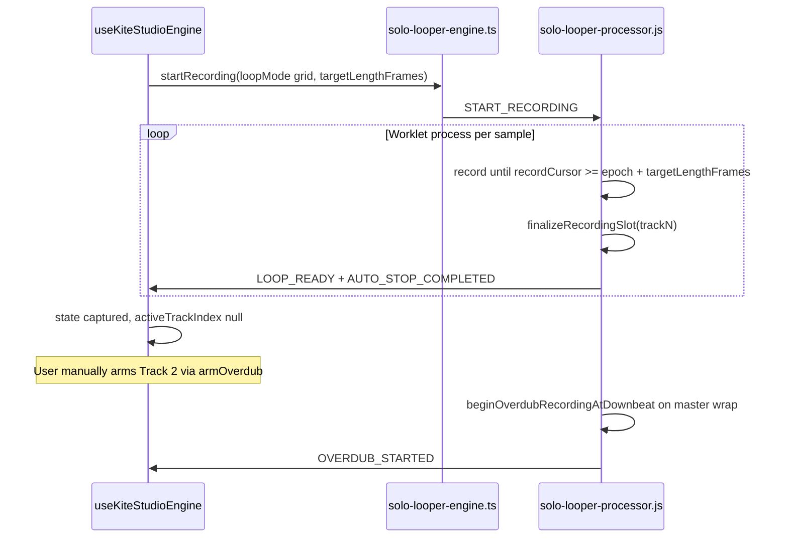

# Handsfree Mode — Implementation Plan

**Status:** Engine-first (HF-1 → HF-6), then UI (HF-7).

**Prerequisite gate (mandatory):** Batch **HF-7 must not begin** until HF-1 through HF-6 are complete, merged, and regression-tested:

- Free Mode: `stopAtContextSec` pedal-up finalize still works.
- Grid Mode: manual track switching + bar-quantized auto-stop unchanged.
- Handsfree engine path: T1→T4 sequence verified via dev trigger (no UI dependency).

HF-7 is **presentation and wiring only** — zero changes to `solo-looper-processor.js`, `solo-looper-engine.ts`, or `useKiteStudioEngine.ts` event/audio logic.

---

## Current Architecture (Baseline)



**Grid auto-stop (worklet-owned, must not regress):**

```1296:1317:public/worklets/solo-looper-processor.js
          if (
            active.loopMode === "grid" &&
            active.targetLengthFrames !== null &&
            active.recordCursor >=
              (active.recordingEpochFrames || 0) +
              active.targetLengthFrames
          ) {
            // ... finalizeRecordingSlot + postAutoStopCompleted
          }
```

**Free Mode (must not regress):** separate branch uses `pendingStopAbsoluteFrame` + `stopAtContextSec` from [commitActiveRecording](hooks/useKiteStudioEngine.ts) (lines ~5147–5149). Gated on `loopMode === "free"`.

**React track index sync today:** `syncActiveRecordTrackIndex()` updates ref + `soloActiveRecordTrackIndex` state. `AUTO_STOP_COMPLETED` clears it and sets `captured` for Track 1 — incompatible with handsfree mid-sequence.

---

## 1. State Representation

### Recommended: `loopMode: "handsfree"` + runtime sequence flag

| Layer | Field | Purpose |
|-------|-------|---------|
| Types | `SoloLooperMode = "free" \| "grid" \| "handsfree"` in [useKiteStudioEngine.types.ts](hooks/useKiteStudioEngine.types.ts) | User-facing mode; drives `targetLengthFrames` computation |
| Bridge params | Extend `SoloLooperStartRecordingParams.loopMode` in [solo-looper-engine.ts](lib/solo-looper-engine.ts) | Pass `"handsfree"` through `START_RECORDING` |
| Worklet slot | `slot.loopMode = "handsfree"` | Shares grid boundary math |
| Worklet processor | `this.handsfreeSequenceActive: boolean` | Set `true` on `START_RECORDING` when `loopMode === "handsfree"`; cleared on reset / abort / sequence complete |

**Why not `sequentialRecord: true` alone?** A boolean without `loopMode` would still need grid quantization rules duplicated in React and the worklet. `"handsfree"` is a distinct transport mode that *implies* grid timing but adds auto-advance semantics.

**Helper in worklet (new):**

```javascript
isGridLikeLoopMode(mode) {
  return mode === "grid" || mode === "handsfree";
}
```

Replace the strict `active.loopMode === "grid"` check in the auto-stop branch with `isGridLikeLoopMode(active.loopMode)`.

**Update `normalizeLoopMode`:**

```javascript
normalizeLoopMode(value) {
  if (value === "grid" || value === "handsfree") return value;
  return "free";
}
```

**Regression guard:** `"handsfree"` must never fall through to `"free"` (would break boundary auto-stop and accidentally enable `stopAtContextSec` paths).

### React-side mirrors

- `soloLooperModeRef` already drives [buildStartRecordingParams](hooks/useKiteStudioEngine.ts) (~3727–3753): extend condition to compute `targetLengthFrames` when mode is `"grid"` **or** `"handsfree"`.
- Add `handsfreeSequenceActiveRef: boolean` (main-thread mirror of worklet flag) for guarding pedal handlers and `AUTO_STOP_COMPLETED` UI transitions during T1–T3 handoffs.

---

## 2. Worklet Modifications

### 2.1 New internal method: `beginHandsfreeRecordingAtBoundary(nextTrackIndex, monoSample)`

Called **inside the same `process()` frame** immediately after finalizing track *N*, before playback cursor advance.

Responsibilities:

1. Validate: `handsfreeSequenceActive`, `nextTrackIndex` is 2–4, master (track 1) is `playing` with `intervalFrames > 0`.
2. `this.activeTrackIndex = nextTrackIndex`.
3. Prepare slot (no overdub arm, no downbeat wait):
   - `resetSlotToIdle` if needed, then provision buffer sized to `maxRecordingFrames` (same cap pattern as [armOverdub](public/worklets/solo-looper-processor.js) ~835–846).
   - Copy master metadata: `loopId`, `channelCount`, `loopMode = "handsfree"`.
   - `targetLengthFrames = master.intervalFrames` (exact loop length, not bar-count recompute).
   - `latencyOffsetFrames` from slot or sequence-start value.
4. **No pre-roll** on handoff (unlike `armRecordingSlot` / `beginOverdubRecordingAtDownbeat`). Pre-roll would pull ring-buffer tail from the previous track's acoustic content and create a cross-track bleed at the seam.
5. `mode = "recording"`, `recordingEpochFrames = 0`, `recordCursor = 0`.
6. Write `monoSample` into buffer index 0, increment `recordCursor` to 1 (the boundary sample belongs to the new track).
7. `postHandsfreeTrackAdvanced({ fromTrack: N, toTrack: nextTrackIndex })`.

### 2.2 Modify grid-like auto-stop branch in `process()`

After existing `finalizeRecordingSlot` + conditional `postAutoStopCompleted`:

```
if (handsfreeSequenceActive && capTrackIndex < 4) {
  // Skip postAutoStopCompleted for intermediate tracks (optional — see §3)
  beginHandsfreeRecordingAtBoundary(capTrackIndex + 1, monoSample);
  slotJustFinished = finalizedSlot; // keep playback cursor frozen for N this frame
  // Do NOT treat new active slot as slotJustFinished
} else if (handsfreeSequenceActive && capTrackIndex === 4) {
  handsfreeSequenceActive = false;
  postHandsfreeSequenceComplete();
  postAutoStopCompleted(4); // or fold into sequence-complete event
}
```

**Sample-accuracy invariant:** Handoff occurs in the frame where `recordCursor` crosses `epoch + targetLengthFrames`, *after* writing the last sample to track *N* and *before* advancing playback cursors for track *N* in the same iteration. The first sample of track *N+1* is the same audio frame.

### 2.3 Track 1 start (unchanged entry, new mode value)

[startRecording](public/worklets/solo-looper-processor.js) (~1013–1038): when `loopMode === "handsfree"`:

- Set `this.handsfreeSequenceActive = true`.
- Same `targetLengthFrames` + optional `recordStartContextSec` downbeat gate as grid.
- Track 1 still uses bar-count-derived `targetLengthFrames` from React.

### 2.4 Sequence abort / cleanup

Clear `handsfreeSequenceActive` on:

- `reset()` / `resetTrack(1)` (cascade)
- `stopRecording()` from main thread mid-sequence
- `stopLoop()`
- Failed handoff (master not playing) → `postConfigureRejected` + clear flag

**Regression guard:** When `handsfreeSequenceActive === false`, the auto-stop branch must behave identically to today's grid path (including `postAutoStopCompleted` on every stop).

### 2.5 Free Mode isolation

Do not touch:

- `pendingStopAbsoluteFrame` branch (~1318–1343)
- `stopTargetFrames` deferred finalize branch (~1344–1360)
- `stopRecording()` `hasFreeDeferredStop` logic (~699–714)

Add an early guard in `beginHandsfreeRecordingAtBoundary`: no-op if `!handsfreeSequenceActive`.

---

## 3. Bridge Modifications ([solo-looper-engine.ts](lib/solo-looper-engine.ts))

### 3.1 New outbound events (worklet → main)

```typescript
export type SoloLooperHandsfreeTrackAdvancedEvent = {
  type: "HANDSFREE_TRACK_ADVANCED";
  fromTrack: number;  // 1–3
  toTrack: number;    // 2–4
  sampleRate: number;
};

export type SoloLooperHandsfreeSequenceCompleteEvent = {
  type: "HANDSFREE_SEQUENCE_COMPLETE";
  trackIndex: 4;
  loopId: string | null;
};
```

Add both to `SoloLooperEngineEvent` union and the port `allowlist` (~344–356).

### 3.2 Inbound (main → worklet)

No new message types required if `loopMode: "handsfree"` on existing `START_RECORDING` suffices.

Optional future: `ABORT_HANDSFREE_SEQUENCE` — not needed for MVP if `stop()` / `reset()` suffice.

### 3.3 Race-condition rules

| Rule | Rationale |
|------|-----------|
| Worklet emits `HANDSFREE_TRACK_ADVANCED` **after** audio handoff in the same synchronous worklet turn | React is always one message behind audio, never ahead |
| React must **not** call `selectTrack()` or `startRecording()` to advance during an active handsfree sequence | Would fight worklet authority and create gaps |
| React `HANDSFREE_TRACK_ADVANCED` handler only mirrors state (`syncActiveRecordTrackIndex(toTrack)`); it does not start transport | UI sync only |
| `commitActiveRecording` should no-op (or abort sequence cleanly) when `handsfreeSequenceActiveRef.current === true` | Prevents pedal-up from sending `stopAtContextSec` into a grid-like auto-stop sequence |
| `PLAYBACK_UI_STATE` sanitization (~3313–3323): during handsfree, trust worklet `recording` mode on the active track without rewriting to `captured`/`playing` | Current sanitizer assumes only one recording track and hides mismatches — update guard to allow worklet-reported recording slot when `handsfreeSequenceActiveRef` is true |

---

## 4. React Orchestration ([useKiteStudioEngine.ts](hooks/useKiteStudioEngine.ts))

### Event handler changes in `handleSoloLooperEvent`

**`HANDSFREE_TRACK_ADVANCED` (new):**

- `syncActiveRecordTrackIndex(event.toTrack)`
- Keep `soloLooperStateRef` / `setSoloLooperState("recording")`
- Restart loop progress RAF anchored to master interval (reuse grid progress math with `masterLoopIntervalFramesRef` once Track 1 `LOOP_READY` has set it)
- Do **not** stop metronome until sequence completes (Track 1 only stops metronome today on manual stop)

**`HANDSFREE_SEQUENCE_COMPLETE` (new):**

- `handsfreeSequenceActiveRef.current = false`
- `syncActiveRecordTrackIndex(null)`
- `setSoloLooperState("captured")` (or `"playing"` if product prefers all-tracks-live label)
- Stop metronome, cancel scheduled clicks
- Update `soloTrackSlotUi` all four slots → `playing`

**`AUTO_STOP_COMPLETED` (modify):**

- If `handsfreeSequenceActiveRef.current && event.trackIndex < 4`: **return early** (intermediate finalize; UI updated by `HANDSFREE_TRACK_ADVANCED` + `LOOP_READY` instead)
- Otherwise: existing behavior unchanged

**`LOOP_READY` during handsfree:**

- Track 1: keep existing master buffer retention (`masterLoopIntervalFramesRef`, `hasCapturedFirstKiteLoopRef`)
- Tracks 2–4: retain buffer refs if needed for export; do **not** flip global state to `captured` until sequence complete

### Start path

In `buildStartRecordingParams` (~3727): treat `"handsfree"` like `"grid"` for `targetLengthFrames`.

On sequence start (~3759): set `handsfreeSequenceActiveRef.current = true` before `engine.startRecording({ loopMode: "handsfree", ... })`.

### Pedal / transport guards

- `onLooperPedalDown`: if handsfree sequence active, ignore track-arm gestures (or map pedal-down to abort — product decision; default **ignore** to prevent accidental interruption)
- `handleArmSoloOverdubTrack`: early return when `handsfreeSequenceActiveRef`
- `handleStopAndResetSoloLooper`: clear `handsfreeSequenceActiveRef`

---

## 5. Execution Batches (Rule of One)

Each batch = **one file** = **one logical change** = independently testable.

Engine batches **HF-1 → HF-6** must be completed and verified before **any** HF-7 UI work begins.

### Batch HF-1 — Types only

**File:** [hooks/useKiteStudioEngine.types.ts](hooks/useKiteStudioEngine.types.ts)

- Extend `SoloLooperMode` with `"handsfree"`.
- Add optional `handsfreeSequenceActive?: boolean` to `KiteEngineState` (for UI disabled states in HF-7).

**Test:** TypeScript compile only.

**NOT touched:** worklet, bridge, hook logic, UI.

---

### Batch HF-2 — Bridge event types + allowlist

**File:** [lib/solo-looper-engine.ts](lib/solo-looper-engine.ts)

- Extend `loopMode` unions on start/stop params with `"handsfree"`.
- Add `HANDSFREE_TRACK_ADVANCED` and `HANDSFREE_SEQUENCE_COMPLETE` event types + union members.
- Add both to port allowlist.

**Test:** Compile; existing looper still runs (no worklet emits yet).

**NOT touched:** worklet, hook, UI.

---

### Batch HF-3 — Worklet: grid-like normalization + sequence flag

**File:** [public/worklets/solo-looper-processor.js](public/worklets/solo-looper-processor.js)

- Add `isGridLikeLoopMode`, update `normalizeLoopMode`.
- Add `this.handsfreeSequenceActive = false` in constructor; set/clear in `startRecording` / `reset`.
- Replace `loopMode === "grid"` with `isGridLikeLoopMode(loopMode)` in auto-stop branch only.

**Test (critical regression):**

1. Free Mode Track 1: pedal-up with `stopAtContextSec` still finalizes at stamped frame.
2. Grid Mode Track 1: auto-stop at bar boundary unchanged.
3. Grid overdub arm → downbeat record unchanged.

**NOT touched:** handoff logic yet, UI.

---

### Batch HF-4 — Worklet: sample-accurate handoff

**File:** [public/worklets/solo-looper-processor.js](public/worklets/solo-looper-processor.js)

- Implement `beginHandsfreeRecordingAtBoundary`.
- Implement `postHandsfreeTrackAdvanced` / `postHandsfreeSequenceComplete`.
- Wire into auto-stop branch with `handsfreeSequenceActive` guards.
- Suppress intermediate `postAutoStopCompleted` (tracks 1–3) during active sequence.

**Test:**

1. DevTools: post `START_RECORDING` with `loopMode: "handsfree"` + `targetLengthFrames`; verify four `LOOP_READY` messages and three `HANDSFREE_TRACK_ADVANCED` without audible gaps (localhost Chrome).
2. Re-run Free + Grid regression from HF-3.

**NOT touched:** React hook, UI.

---

### Batch HF-5 — React: refs + start params

**File:** [hooks/useKiteStudioEngine.ts](hooks/useKiteStudioEngine.ts)

- `handsfreeSequenceActiveRef`.
- Extend `buildStartRecordingParams` for `"handsfree"`.
- Set/clear ref on start and `handleStopAndResetSoloLooper`.
- Guard `commitActiveRecording`, `handleArmSoloOverdubTrack`, `onLooperPedalDown`.

**Test:** Manually trigger handsfree via temporary dev call; verify guards prevent double-stop.

**NOT touched:** `handleSoloLooperEvent`, UI.

---

### Batch HF-6 — React: event sync

**File:** [hooks/useKiteStudioEngine.ts](hooks/useKiteStudioEngine.ts)

- Handle `HANDSFREE_TRACK_ADVANCED` and `HANDSFREE_SEQUENCE_COMPLETE`.
- Branch `AUTO_STOP_COMPLETED` and `PLAYBACK_UI_STATE` sanitization for handsfree.
- Adjust `LOOP_READY` to defer global `captured` until sequence complete.

**Test (full engine path — required before HF-7):**

1. Localhost Chrome: record handsfree T1→T4 via dev trigger; UI `soloActiveRecordTrackIndex` follows 1→2→3→4 without manual taps; all tracks play after T4.
2. Grid Mode manual multi-track still works.
3. Free Mode still works.

**NOT touched:** UI panel.

---

### Batch HF-7 — UI integration (final batch; engine must be done first)

> **Do not write React code for HF-7 until HF-1 through HF-6 are complete and tested.** HF-7 adds no audio-engine behavior — it exposes `"handsfree"` in Settings and refactors calibration layout.

**Scope summary:**

| Deliverable | File | What changes |
|-------------|------|--------------|
| Handsfree toggle + calibration relocation | [KiteLoopV4Panel.tsx](components/kite-loop-v2/KiteLoopV4Panel.tsx) | Settings modal layout only |
| Presenter passthrough | [app/studio-bridge/page.tsx](app/studio-bridge/page.tsx) | Confirm `"handsfree"` type flows through existing handlers |

**Target layout after HF-7:**

```
┌─────────────────────┬─────────────────────┬─────────────────────┐
│  BPM & Timing       │  Time Signature     │  Grid Engine        │
│  ─ tempo / TAP      │  ─ sig buttons      │  ─ Grid Mode toggle │
│  ─ presets          │  ─ Metronome vol    │  ─ Handsfree toggle │  ← NEW
│  ─ CALIBRATION ←────│                     │  ─ Bar Count        │
│    (relocated)      │                     │                     │
└─────────────────────┴─────────────────────┴─────────────────────┘
```

HF-7 is split into two sub-batches (Rule of One: one file per sub-batch):

#### HF-7A — Settings modal: Handsfree toggle + Calibration relocation

**File:** [components/kite-loop-v2/KiteLoopV4Panel.tsx](components/kite-loop-v2/KiteLoopV4Panel.tsx)

**Target component:** `SettingsModal` (~lines 860–1400).

##### Current layout reference

| Column | Content today |
|--------|---------------|
| Col 1 (left, `paddingLeft: 20`) | **BPM & Timing** — tempo display, slider, TAP, presets — *empty space below presets* |
| Col 2 (middle) | **Time Signature** + **Metronome** volume / visual-only toggles |
| Col 3 (right, `paddingRight: 20`) | **Grid Engine** — Grid Mode toggle, Bar Count + **Latency Calibration** (~lines 1222–1395) |

---

##### A. Handsfree Mode toggle

**Placement:** Directly beneath the existing Grid Mode `<Toggle>` in Col 3 (**Grid Engine**), ~line 1185 — inside the same `flexDirection: "column", gap: 10` wrapper, **before** the Bar Count row.

**Component:** Reuse the shared `<Toggle>` primitive (~lines 177–218). Do not build a new switch.

**Visual spec — mirror Grid Mode toggle exactly:**

| Design token (spec) | Implementation in `KiteLoopV4Panel` |
|---------------------|--------------------------------------|
| Glass-panel aesthetic | Existing `glass` / `glassSharp` inline tokens on Settings modal shell (`background: rgba(10,10,10,0.75)`, blur, zinc border) |
| `bg-zinc-900/80` | Equivalent: modal inherits `glass` token; toggle row needs no extra panel wrapper |
| `emerald-500` active state | `EMERALD` constant (`#22c55e`) — toggle pill `background: checked ? EMERALD : "rgba(255,255,255,0.1)"` |
| Typography | Label: `fontSize: 11`, `rgba(255,255,255,0.65)`; sublabel: `fontSize: 9`, `rgba(255,255,255,0.3)` — identical to Grid toggle |
| Icons | Text-only to match current Grid toggle (no icon on Grid today). Do not add icons to Handsfree alone. |

**Copy:**

- Label: **"Handsfree Mode"**
- Sublabel: **"Auto-record tracks 1→4 at loop boundaries"**

**Wiring — set `loopMode` to `"handsfree"`:**

- `onChange` ON → `handlers.onLoopModeChange("handsfree")`
- `onChange` OFF → `handlers.onLoopModeChange("free")`
- `checked={cfg.loopMode === "handsfree"}`

**Mutual exclusivity (required):**

Engine stores one `SoloLooperMode`. UI must never show Grid + Handsfree both ON.

| User action | Resulting `loopMode` | UI state |
|-------------|----------------------|----------|
| Grid toggle **ON** | `"grid"` | Grid ON, Handsfree OFF, Free OFF |
| Grid toggle **OFF** (was Grid) | `"free"` | Both OFF |
| Handsfree toggle **ON** | `"handsfree"` | Handsfree ON, Grid OFF, Free OFF |
| Handsfree toggle **OFF** (was Handsfree) | `"free"` | Both OFF |

```typescript
const handsfreeMode = cfg.loopMode === "handsfree";
const gridMode = cfg.loopMode === "grid";

// Grid toggle
<Toggle
  checked={gridMode}
  onChange={(on) => handlers.onLoopModeChange(on ? "grid" : "free")}
  label="Grid Mode"
  sublabel="Off = Free Mode (no quantize)"
/>

// Handsfree toggle — directly below Grid toggle
<Toggle
  checked={handsfreeMode}
  onChange={(on) => handlers.onLoopModeChange(on ? "handsfree" : "free")}
  label="Handsfree Mode"
  sublabel="Auto-record tracks 1→4 at loop boundaries"
/>
```

**Bar Count:** Enable when `gridMode || handsfreeMode`. Change `disabled={!gridMode}` (~line 1198) → `disabled={!gridMode && !handsfreeMode}`. Update inactive button opacity/color guards similarly.

**Recording lock:** When `cfg.isTimingLocked`, both toggles use same `pointerEvents: none` / reduced opacity as other locked controls.

---

##### B. Calibration UI relocation

**Move from:** Col 3 (Grid Engine), block starting at `{sLabel("Latency Calibration")}` (~line 1231) through Advanced Settings / RTL Compensation collapsible (~line 1395).

**Move to:** Col 1 (**BPM & Timing**), directly below the tempo preset row (`Slow` / `Mid` / `Fast`, ~line 1093) — the dark empty space under BPM controls.

**Components to relocate (cut/paste as one unit, no logic changes):**

- `{sLabel("Latency Calibration")}`
- Acoustic calibrate button (`triggerCalibration("acoustic")`)
- Interface calibrate button (`triggerCalibration("interface")`)
- `AlertTriangle` warning callout (`selectedWarning`)
- `calibrationMessage` status pill
- "Advanced Settings" chevron collapsible
- RTL Compensation slider (`rtlCompensation` / `handlers.onLatencyMsChange`)

**Col 1 structure after move:**

```
BPM & Timing
├── BPM display + slider
├── TAP + tempo presets (Slow / Mid / Fast)
├── ─── section divider ───
└── Latency Calibration          ← relocated block
    ├── calibrate buttons
    ├── warning callout
    ├── status pill
    └── Advanced Settings (RTL slider)
```

**Styling — blend with Zinc/Emerald panel:**

- Section divider: `borderTop: "1px solid rgba(255,255,255,0.05)", paddingTop: 12, marginTop: 4` (match Grid Engine internal dividers).
- Calibrate buttons: keep existing emerald borders/backgrounds (`rgba(34,197,94,...)`) — already on-brand.
- RTL advanced block: keep orange accent for functional distinction; do not recolor to emerald.
- Column rhythm: preserve Col 1 `gap: 12` from `col` style; inner calibration `gap: 8`.
- Responsive: Col 1 `minWidth: "min(200px, 100%)"` unchanged; modal row keeps `flexWrap: "wrap"`.

**Col 3 after relocation:** Grid Engine column contains **only** — section label, Grid toggle, Handsfree toggle, Bar Count. No calibration UI remains in Col 3.

**Props/handlers:** No new props. Reuse `cfg.latencyMs`, `handlers.onAutoCalibrateLatency`, `handlers.onLatencyMsChange`, `handlers.autoCalibrateLatencyStatus`, `handlers.autoCalibrateLatencyMessage`. DOM/layout move only.

**NOT touched in HF-7A:** `solo-looper-processor.js`, `solo-looper-engine.ts`, `useKiteStudioEngine.ts` engine logic.

---

#### HF-7B — Presenter wiring

**File:** [app/studio-bridge/page.tsx](app/studio-bridge/page.tsx)

- Confirm `loopMode: soloLooperMode` is already passed into `KiteLoopV4Panel` config (~line 2007).
- Confirm `onLoopModeChange: setSoloLooperMode` handler accepts `"handsfree"` after HF-1 type extension (no engine changes — type-only passthrough).
- No additional engine actions required if `setSoloLooperMode` from [useKiteStudioEngine.ts](hooks/useKiteStudioEngine.ts) already exposes the extended union.

**NOT touched:** Engine hook logic, worklet, bridge.

---

#### HF-7 verification checklist

1. Open Settings modal → Handsfree toggle appears directly under Grid Mode toggle with matching visual weight.
2. Toggle Handsfree **ON** → Grid toggle shows off; `soloLooperMode` becomes `"handsfree"` (React devtools / console).
3. Toggle Grid **ON** while Handsfree was on → Handsfree turns off; mode becomes `"grid"`.
4. Toggle Handsfree **OFF** → mode returns to `"free"`.
5. Bar Count buttons enabled in both Grid and Handsfree modes; disabled in Free mode.
6. Calibration UI appears under BPM column (not in Grid Engine column); acoustic/interface calibrate still works.
7. RTL Advanced slider still adjusts latency offset.
8. Full handsfree record T1→T4 from UI (not dev trigger) after engine batches verified.
9. Regression: Free and Grid modes still record correctly after layout refactor.

---

## 6. Verification Matrix

| Phase | Scenario | Pass criteria |
|-------|----------|---------------|
| 1 | Localhost Chrome, 2 tabs | Full T1→T4 handsfree; no gap >1 block at handoffs; UI track highlight matches audio |
| 2 | Same WiFi, 2 devices | Same (solo mode only; no P2P changes) |
| 3 | WiFi + mobile data | Same |
| 4 | METU/eduroam | Same; no extra main-thread messages per frame |

**Latency note:** Handoff adds zero main-thread round trips per boundary — only one `postMessage` per track advance (async to audio).

---

## 7. Explicit Non-Goals (Regression Guards)

- Do **not** change overdub arm/downbeat path for standard Grid Mode.
- Do **not** alter `stopAtContextSec` / `pendingStopAbsoluteFrame` Free Mode plumbing.
- Do **not** route live input to output (monitoring path unchanged).
- Do **not** touch P2P signaling, mic graph, or `useKiteStudioHost` context lifecycle.
- Do **not** use `setTimeout` / wall-clock for track handoffs.
- Do **not** begin HF-7 UI work before HF-6 engine verification passes.

---

## 8. Open Product Decisions (safe defaults chosen above)

- **Pedal during handsfree:** default ignore (no abort).
- **Final state label:** `"captured"` after T4 (matches current Track 1 grid auto-stop UX).
- **Metronome:** keep audible through T1–T4 sequence; stop on `HANDSFREE_SEQUENCE_COMPLETE`.
