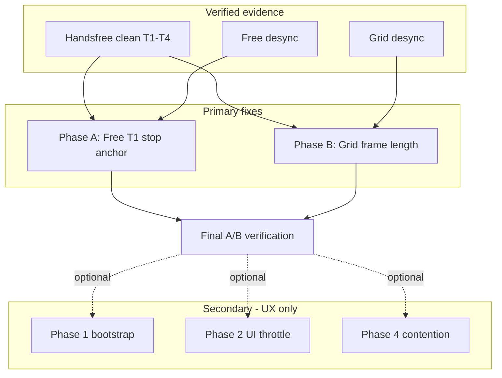

# Loopstation Audio Sync Regression — Final Execution Plan

**Status:** Ready for review — do not implement until approved  
**Date:** 2026-06-29  
**Baseline:** git `6ff1722` · Vercel `dpl_8cMJxfbo1EQfUhnmERxA9dcFK1si`  
**Regression anchor:** `e31a944` (`useKiteStudioEngine` + `KiteLoopV4Panel` diffs)  
**Related:** [audio-sync-diagnostic.md](.cursor/plans/audio-sync-diagnostic.md)

---

## 1. Executive summary

Grid and Free loopstation modes are audibly off-sync vs the good deployment. Handsfree is **verified clean** across a full T1→T4 sequence. The worklet ([`solo-looper-processor.js`](public/worklets/solo-looper-processor.js)) is **byte-identical** `6ff1722` → HEAD — quantization logic is not the suspect.

**Primary fix targets** (only code paths that changed AND that Free/Grid use but Handsfree does not):

| Phase | Hypothesis | Changed in regression diff |
|-------|------------|----------------------------|
| **A** | Free T1 stop-anchor regression (`freePedalStopContextSecRef`) | Pedal-down ref vs commit-time `ctx.currentTime` |
| **B** | Grid T1 frame-length regression (`computeGridTargetLengthFrames` + BPM ref) | New rounding formula + `recordingStartBpmRef.current` |

**Secondary** (UX/perf only — **not expected to fix desync** because Handsfree is unaffected):

- Phase 1 — bootstrap race  
- Phase 2 — PLAYBACK_UI_STATE throttle / lane-fill rAF  
- Phase 4 — main-thread resize contention  

Each primary phase: **measure first → isolated commit → verify → Handsfree regression guard**.

---

## 2. Hard constraints (do not contradict)

| Constraint | Detail |
|------------|--------|
| **Handsfree clean** | Tested — matches good deployment. Full T1→T4, no desync. |
| **Free broken** | Reproducible, distinguishable from `6ff1722`. |
| **Grid broken** | Reproducible, distinguishable from `6ff1722`. |
| **Worklet lock** | Do **not** edit [`solo-looper-processor.js`](public/worklets/solo-looper-processor.js) unless Phase B produces **measured** frame divergence. |
| **UI preservation** | Keep `e31a944` loopstation UI intact (glow, webcam frame, red idle Record, settings, lane fills). See §10. |
| **Rule of One** | One phase = one revertible commit with before/after measurement. |
| **No premature WIP** | Uncommitted changes exist — review against this plan; do not land as one combined patch. |

---

## 3. Evidence-based root-cause framing

### 3.1 What Handsfree clean rules out as **primary** cause

Handsfree T2–T4 uses `beginHandsfreeRecordingAtBoundary` — worklet-internal, same `process()` frame, zero main-thread round trip after T1. If mode-agnostic issues were the root cause, Handsfree would also drift. It does not.

| Ruled out as primary | Why |
|----------------------|-----|
| Bootstrap race (`setStudioUiPhase` before engine boot) | Would affect all modes at enter |
| PLAYBACK_UI_STATE 100ms throttle | UI symptom; Handsfree bypasses manual arm |
| Main-thread RAF / resize re-renders | Would jitter all pedal paths; Handsfree overdub is worklet-only |
| Handler memoization (stale closures) | Would affect all modes equally — prior audit found no missing deps |

These remain **optional secondary improvements**. State explicitly: they are **not expected to fix** reported inter-track desync.

### 3.2 What Free + Grid broken points to

Both modes share the **manual overdub arm path** Handsfree never uses:

```
pedal/tap → onLooperPedalDown → handleArmSoloOverdubTrack → engine.armOverdub(...)
```

They diverge only in **mode-specific main-thread computations** introduced in `6ff1722..HEAD`:

1. **Free** — `freePedalStopContextSecRef` / `stopAtContextSec` plumbing  
2. **Grid** — `computeGridTargetLengthFrames` + `recordingStartBpmRef.current` as Grid BPM source  

### 3.3 Mode transport reference

| Mode | Transport authority | In this plan |
|------|---------------------|--------------|
| **Handsfree** | Worklet-only | Regression guard only — do not touch |
| **Grid** | Main → worklet: `recordStartContextSec`, `targetLengthFrames`, manual `armOverdub` | **Phase B** |
| **Free** | Main → worklet: `recordStartContextSec`, T1 `stopAtContextSec`, manual `armOverdub` | **Phase A** |



---

## 4. Execution order

| # | Phase | Priority | Expected desync impact |
|---|-------|----------|------------------------|
| **A** | Free stop-anchor regression | **Primary** | Fix Free; may fix T2 alignment via correct T1 master length |
| **B** | Grid frame-length regression | **Primary** | Fix Grid T1 auto-stop / master length / overdub lock |
| 1 | Bootstrap ordering | Secondary | Studio enter UX only |
| 2 | PLAYBACK_UI_STATE isolation | Secondary | Lane/arm UI responsiveness only |
| 4 | Main-thread contention | Secondary | Panel perf only |
| 0 | Shared `armOverdub` timing diagnostic | **Fallback** | Only if A+B do not resolve; see §9 |

---

## 5. Phase A — Free stop-anchor regression (TOP PRIORITY)

### 5.1 Code diff: `6ff1722` vs HEAD

**Good deployment (`6ff1722`)** — [`hooks/useKiteStudioEngine.ts`](hooks/useKiteStudioEngine.ts) `commitActiveRecording`:

```ts
engine.stopRecording({
  ...
  ...(soloLooperModeRef.current === "free" && activeTrackIndex === 1
    ? { stopAtContextSec: ctx.currentTime }   // sampled at commit time
    : {}),
});
```

- `stopAtContextSec` sent **only for Free T1**.
- No `freePedalStopContextSecRef`; no pedal-down pre-sampling.

**HEAD (committed):**

```ts
// onLooperPedalDown — any free-mode recording stop:
freePedalStopContextSecRef.current = ctx.currentTime;

// commitActiveRecording:
const stopAtContextSec =
  soloLooperModeRef.current === "free"
    ? freePedalStopContextSecRef.current ?? ctx.currentTime
    : ctx.currentTime;
const isFreeT1 = soloLooperModeRef.current === "free" && activeTrackIndex === 1;
engine.stopRecording({
  ...
  ...(isFreeT1 ? { stopAtContextSec } : {}),  // still T1-only to engine
});
```

**Worklet gate (unchanged both deployments)** — [`solo-looper-processor.js`](public/worklets/solo-looper-processor.js) ~784–789:

```js
const hasFreeDeferredStop =
  slot.loopMode === "free" &&
  targetTrackIndex === 1 &&
  Number.isFinite(stopAtContextSec) &&
  stopAtContextSec > 0;
```

Free T2–T4 stops use `computeFinalIntervalFrames` + `masterPhase` at finalize — **no `stopAtContextSec`** in either deployment.

### 5.2 Audit nuance (do not skip)

| | Good (`6ff1722`) | HEAD |
|--|------------------|------|
| T1 stop anchor | `ctx.currentTime` at **commit** | `freePedalStopContextSecRef` at **pedal-down** |
| T2–T4 stop | Worklet `masterPhase` at finalize | Same |

The regression is **not** "T2–T4 now receive `stopAtContextSec`." The behavioral change is **when** T1's anchor is sampled.

**Hypothesis:** Pedal-down ref sampling introduces event-loop delay into T1 master loop length → T2 overdubs sound off even though T2's own stop path is unchanged. If T2 desync persists after T1 revert, escalate to shared `armOverdub` path (§9).

[`audio-sync-diagnostic.md`](.cursor/plans/audio-sync-diagnostic.md) documents ref-based anchor as intentional hardening — confirm scope before reverting.

**Hold:** Do **not** land uncommitted `onPedalDownPrepare` / `sampleFreePedalStopContextSec` until A.1 completes. Earlier sampling widens pedal→commit gap if revert is the fix.

### 5.3 Step A.1 — Instrument (dev-only commit)

**File:** [`hooks/useKiteStudioEngine.ts`](hooks/useKiteStudioEngine.ts) only.

For **3 Free-mode cycles** (T1 record → T2 overdub → stops), log via `logDriftDiagnostic`:

| Field | When |
|-------|------|
| `freePedalStopContextSecRef.current` | At `commitActiveRecording` |
| `ctx.currentTime` at commit | Same moment |
| `commitTime - refTime` (ms) | Pedal-down vs commit gap |
| `activeTrackIndex` | Confirm T1 vs T2+ |
| `stopAtContextSec` sent to engine | Must be **T1 only** (`isFreeT1`) |
| Master phase / cursor | From worklet events if available |

Compare vs `6ff1722` on same test if reachable; else document from code diff.

**Gate:** Proceed to A.2 only with **numeric** pedal-down vs commit deltas — not theory alone.

### 5.4 Step A.2 — Fix (isolated commit, after A.1)

Revert Free T1 stop anchor to good-deployment behavior:

```ts
...(soloLooperModeRef.current === "free" && activeTrackIndex === 1
  ? { stopAtContextSec: ctx.currentTime }
  : {}),
```

Remove `freePedalStopContextSecRef` sampling from `onLooperPedalDown` if unused elsewhere.

**NOT touched:** worklet, Grid math, panel UI, bootstrap order.

### 5.5 Verify & go/no-go

| Check | Pass |
|-------|------|
| Free: 3 overdub cycles | Stop point / length matches `6ff1722` |
| T1 master frames | Stable across cycles |
| T2 overdub | Locks to master phase |
| **Handsfree guard** | T1→T4 still perfect |

| Result | Action |
|--------|--------|
| **Go** | Proceed to Phase B |
| **No-go** | Log findings; run §9 `armOverdub` diagnostic before secondary phases |

---

## 6. Phase B — Grid frame-length regression (SECOND PRIMARY)

### 6.1 Code diff: `6ff1722` vs HEAD

**Good deployment:**

```ts
const secondsPerBeat = 60 / bpm;
const totalSeconds = secondsPerBeat * beatsPerBar * barCount;
targetLengthFrames = Math.max(1, Math.round(totalSeconds * startSampleRate));
```

**HEAD:**

```ts
targetLengthFrames = computeGridTargetLengthFrames(startSampleRate, bpm, beatsPerBar, barCount);
// framesPerBeat = Math.round(sr * (60 / bpm)); return framesPerBeat * totalBeats
```

Grid BPM source now prefers `recordingStartBpmRef.current` over `timingSnapshot?.bpm`.

**UI coupling:** `loopProgressDurationSecRef` derives from `targetLengthFrames` at T1 start (~3966–3970). Progress bar / downbeat UI may **appear** desynced if prediction ≠ worklet `intervalFrames` from `LOOP_READY` — check even when worklet alignment is internally correct.

### 6.2 Step B.1 — Measure (dev-only commit, before fix)

**File:** [`hooks/useKiteStudioEngine.ts`](hooks/useKiteStudioEngine.ts)

| Log point | Fields |
|-----------|--------|
| T1 `startRecording` | `computeGridTargetLengthFrames` output, `recordingStartBpmRef.current`, `timingSnapshot.bpm`, `sampleRate`, `beatsPerBar`, `barCount` |
| `LOOP_READY` track 1 | `event.intervalFrames`, delta vs predicted |
| Formula cross-check | Worklet: `Math.round(sampleRate * (60/bpm)) * totalBeats` |

**Test matrix:**

- 120 BPM / 4/4 / 1 bar @ 48 kHz  
- 90 BPM / 4/4 / 2 bars @ 44.1 kHz  
- One non-default bar count from UI  

### 6.3 Step B.2 — BPM ref divergence check

Confirm `recordingStartBpmRef.current` cannot diverge from worklet `resolveBpm` at record start (BPM change mid-arm, ref captured at different moment).

### 6.4 Step B.3 — Fix (isolated commit, only if B.1 shows divergence)

One of (cite measured deltas in commit message):

- Align `computeGridTargetLengthFrames` with worklet rounding  
- Revert to `Math.round(totalSeconds * sampleRate)` if equivalent at measured BPMs  
- Fix BPM source to match worklet snapshot  

**Worklet lock:** No [`solo-looper-processor.js`](public/worklets/solo-looper-processor.js) edit unless B.1 shows main-thread prediction ≠ worklet `intervalFrames`.

### 6.5 Verify & go/no-go

| Check | Pass |
|-------|------|
| Grid T1→T2→T3→T4 | 2–3 BPM/SR combos |
| T2+ lock | Master downbeat ±1 quantum |
| Progress bar | Reaches 100% with audible boundary |
| **Handsfree guard** | T1→T4 still perfect |

| Result | Action |
|--------|--------|
| **Go** | Final verification (§8) |
| **No-go** (frames match, audio drifts) | Close frame-math hypothesis with evidence; run §9 |

---

## 7. Secondary phases (optional — after A+B verify)

### Phase 1 — Bootstrap ordering

**Not expected to fix desync.**

**Files:** [`hooks/useKiteStudioEngine.ts`](hooks/useKiteStudioEngine.ts)

- `handleEnterSoloStudio`: `await ensureSoloLooperEngineBootstrapped()` **before** `setStudioUiPhase("studio")` (in uncommitted WIP).
- **Bypass still open:** `handleConfirmKiteSetup` ~4788 sets studio phase before bootstrap for solo wizard path.

**Outcome:** Panel does not hydrate during engine build. No audio desync claim.

### Phase 2 — PLAYBACK_UI_STATE isolation

**Not expected to fix desync.**

| File | Change |
|------|--------|
| [`useKiteStudioEngine.ts`](hooks/useKiteStudioEngine.ts) | `slotsPlaybackUiStructuralEqual` (exclude cursors); remove 100ms throttle |
| [`page.tsx`](app/studio-bridge/page.tsx) | Pass `soloTrackSlotUiLatestRef` |
| [`KiteLoopV4Panel.tsx`](components/kite-loop-v2/KiteLoopV4Panel.tsx) | Ref-driven lane-fill rAF |

**Audit confirmed:** `armDisabled` in [`page.tsx`](app/studio-bridge/page.tsx) ~522–531 uses engine state refs, not throttled `soloTrackSlotUi`. Transport is not UI-gated.

**Hold back:** `onPedalDownPrepare` — conflicts with Phase A revert candidate.

### Phase 4 — Main-thread contention

**Not expected to fix desync.**

**File:** [`KiteLoopV4Panel.tsx`](components/kite-loop-v2/KiteLoopV4Panel.tsx) — `applyWebcamFrameLayout` ref-based resize (drafted in uncommitted WIP). Replaces `viewportSize` setState + `useLayoutEffect` resize listener.

---

## 8. Final verification (after Phase A and B)

**Build:** `npm run build && npm run start`

### 8.1 Audio sessions

| Session | Steps | Pass criteria |
|---------|-------|---------------|
| **Free** | 3 overdub cycles (T1 + T2 stops) | Matches `6ff1722` stop point / length |
| **Grid** | T1→T2→T3→T4 @ 2–3 BPM/SR | T2+ locks to master downbeat |
| **Handsfree regression guard** | Full T1→T4 | **Must remain perfect** — if broken, revert immediately (wrong path touched) |

### 8.2 Side-by-side baseline

Compare fixed HEAD vs `6ff1722` local checkout **or** stable Vercel (`dpl_8cMJxfbo1EQfUhnmERxA9dcFK1si`).

### 8.3 Test sequence (mandatory order)

1. Localhost Chrome, two tabs  
2. Same WiFi, two devices  
3. Cross-network (WiFi + mobile data)  
4. Restrictive campus WiFi (METU/eduroam-style)  

### 8.4 UI contract (no regressions)

Per [audio-sync-diagnostic.md](.cursor/plans/audio-sync-diagnostic.md):

- Studio glow letterbox, webcam frame + shadow  
- Red idle Record Session button  
- Handsfree toggle, calibration under BPM  
- Grid T1 metronome after auto-stop  
- Lane progress fills, settings Grid/Handsfree exclusivity  

### 8.5 Deliverable

Update [audio-sync-diagnostic.md](.cursor/plans/audio-sync-diagnostic.md):

- Phase A: pedal-down vs commit-time deltas; T1-only gate confirmation  
- Phase B: predicted vs `LOOP_READY` frame table  
- Ruled-out hypotheses (bootstrap, UI throttle, contention) with Handsfree evidence  
- Handsfree regression guard result per commit  

---

## 9. Fallback — shared `armOverdub` timing (Phase 0 diagnostic)

**Run only if Phase A and B do not fully resolve Free/Grid desync.**

Both broken modes use `handleArmSoloOverdubTrack → engine.armOverdub(...)`. Handsfree does not.

**File:** [`hooks/useKiteStudioEngine.ts`](hooks/useKiteStudioEngine.ts)

Add temporary `performance.mark` / `performance.measure`:

1. `kite:pedal-down` — `onLooperPedalDown` when arming T2+  
2. `kite:arm-overdub-post` — immediately before `engine.armOverdub(...)`  
3. Log `kite:pedal-to-arm` duration alongside `[Kite drift]` output  

One Grid-mode T1→T2 overdub session on HEAD. Gate any `armOverdub` changes on measured gap.

**Handler memoization:** Re-audit `useCallback` deps only if marks show stale handler identity. Prior pass: no missing deps. No dedicated commit otherwise.

---

## 10. Uncommitted WIP — do not land combined

| Change | Phase | Action |
|--------|-------|--------|
| Bootstrap reorder (`handleEnterSoloStudio`) | Phase 1 (secondary) | Split commit; fix `handleConfirmKiteSetup` bypass too |
| `slotsPlaybackUiStructuralEqual` + lane rAF | Phase 2 (secondary) | Split commit |
| `soloTrackSlotUiLatestRef` export | Phase 2 | With panel wiring |
| `applyWebcamFrameLayout` | Phase 4 (secondary) | After A+B verify |
| `sampleFreePedalStopContextSec` + `onPedalDownPrepare` | **HOLD** | Conflicts with Phase A revert — measure first |

---

## 11. Commit discipline

| Rule | Detail |
|------|--------|
| Measure before fix | A.1 and B.1 are dev-only instrumentation commits |
| One phase = one revertible commit | Each with before/after numbers |
| Rule of One | One file per logical change where possible |
| Worklet lock | No worklet edits without Phase B measured divergence |
| Handsfree guard | Run Handsfree T1→T4 after **every** primary-phase commit |
| Secondary phases | Only after §8 passes or explicit user request |
| Cleanup | Remove temp instrumentation in final dedicated commit |

---

## 12. Protected paths

Per [`.cursor/rules/ui-engine-isolation.mdc`](.cursor/rules/ui-engine-isolation.mdc):

**Do not edit** (unless Phase B evidence explicitly requires):

- `public/worklets/**`  
- `lib/solo-looper-engine.ts`, `lib/looper-runway-scheduler.ts`, `lib/studio-metronome-pump.ts`  
- `hooks/useKiteSyncEngine.ts`, `hooks/useKiteP2PTransport.ts`  
- `hooks/useKiteStudioHost.ts` AudioContext lifecycle  

Phases A–B touch **`hooks/useKiteStudioEngine.ts`** only. Phases 2/4 touch panel presenter files only.

---

## 13. Checklist (execution tracker)

- [ ] **A.1** — Free stop-anchor instrumentation + 3-cycle baseline numbers  
- [ ] **A.2** — Free T1 revert commit + Free verify + Handsfree guard  
- [ ] **B.1** — Grid frame comparison logs across BPM/SR matrix  
- [ ] **B.2** — BPM ref divergence check  
- [ ] **B.3** — Grid fix commit (if needed) + Grid verify + Handsfree guard  
- [ ] **§8** — Final A/B vs `6ff1722` / stable Vercel  
- [ ] Update `audio-sync-diagnostic.md` with measured results  
- [ ] (Optional) Phase 1 / 2 / 4 secondary commits  
- [ ] (Fallback) §9 `armOverdub` diagnostic if A+B insufficient  
- [ ] Remove temp instrumentation  
