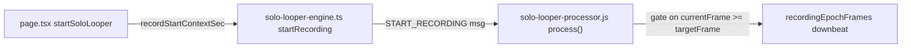

# Loopstation Timing & Calibration Alignment — Phase 7 Execution Blueprint

## Objective
Restore real acoustic RTL calibration (kill the 14ms floor / 0ms applied bug) and make Grid Mode recording sample-accurate and phase-locked by anchoring every musical event to the audio render thread. No wall-clock timers (`setTimeout`/`setInterval`) for musical scheduling.

## Architectural Invariants Enforced
- Rule of One: one batch = one file = one logical change.
- Clock Supremacy: recording epoch, quantization boundaries, and metronome alignment anchor to `AudioContext.currentTime` / worklet frame counters (`currentFrame`).
- No Regressions: do not touch WebRTC signaling, the synchronous hardware kill-switch, or the `useKiteStudioHost` context lifecycle (only an additive latency re-sample is permitted).

## Files In Scope
- `public/worklets/solo-looper-processor.js`
- `app/studio-bridge/page.tsx`
- `lib/solo-looper-engine.ts` (plumbing for the audio-clock anchor)
- `hooks/useKiteStudioHost.ts`

## Boss-Standard DSP Audit (read-only findings, 2026-06-21)
- BOUNDARY CLICK (Track 1 master) — `finalizeRecordingSlot` applies the equal-power seam crossfade only for `targetTrackIndex !== 1` (line ~586). The master track relies solely on `findNearestZeroCrossing` (start + end). When no exact zero-crossing lands inside the 512-frame search window, or a slope discontinuity remains at the seam, the master loop pops on every wrap. This is the primary "not-Boss-smooth" defect. -> addressed in new Phase 7D.1.
- STATE MACHINE — PASS after Phase 7B. Overdub downbeat (`beginOverdubRecordingAtDownbeat`) and grid auto-stop (in `process()`) are already worklet-owned; record-start moves into the worklet under 7B.3. Remaining JS-commanded events (free-mode manual stop, overdub arm/disarm) are inherently user-timed and their quantized boundary is still worklet-owned. No additional batch required.
- MONITORING / PHASING — PASS. The worklet `process()` never routes live input to its output (it sums only `playing` slots plus the calibration burst). The local monitor `<audio>` element is `muted` and torn down on P2P connect (lines ~1661, ~5770-5779). Loop output reaches `ctx.destination` exactly once via `monitorGainNode`; the master-mix destination feeds only WebRTC/tape, not an audible local sink. The `compressor.connect(ctx.destination)` path (line ~2136) carries remote-peer audio, not the local loop. No flanger/comb risk; do not alter routing.
- 7C.1 RACE — low risk (handler writes only two refs, no WebRTC/kill-switch interaction), but harden it (see updated 7C.1).

## Extraction Impact Assessment (2026-06-22)
This section documents how Phase 7 affects the upcoming extraction of the solo looper into `useKiteSoloLooper`.

### Phase 7B — HELPS extraction
Removing `window.setTimeout` (7B.2) is the single highest-value extraction prerequisite in Phase 7. The current `setTimeout` branch closes over `engine` at call time; if the engine is replaced before the timer fires, the stale reference calls the wrong object. After 7B.2, `startSoloLooper` (future `startLooper`) is a clean async function with no background timer, no stale-closure risk, and no `useEffect` cleanup needed. The future hook's teardown becomes trivial.

### Phase 7A & 7D — HELP extraction
Pushing calibration blanking (7A.1) and the seam micro-fade (7D.1) into the worklet, and removing the output-latency subtraction (7A.2) from the event handler, thin the JS boundary. The event handler the future hook wraps becomes lighter and has fewer dependencies.

### Phase 7C.1 — NEUTRAL, correct encapsulation
The `statechange` listener stays entirely inside `useKiteStudioHost`, which has zero knowledge of the looper. The correct provider/consumer hierarchy is established: `useKiteStudioHost` as hardware provider, future `useKiteSoloLooper` as consumer of its `KiteStudioHostApi` outputs.

### Intentional no-anchor `startAudibleMetronome` call sites — MUST DOCUMENT FOR EXTRACTION
After 7B.1 adds an optional `anchorSec` param to `startAudibleMetronome`, two call sites in `page.tsx` remain intentionally anchor-less:
- **Line ~1016** (`useEffect` on `[isVisualMetronomeOnly, soloLooperState, isMasterPaused]`): restarts from `ctx.currentTime` when visual-mode toggles or state changes mid-recording. This is CORRECT: the beats realign from "now."
- **Line ~5205** (`handleToggleMasterPause` un-pause): restarts from `ctx.currentTime` after transport resume. This is CORRECT: real wall time elapsed during the pause.
These must NOT receive anchors. When extracting to `useKiteSoloLooper`, annotate these as intentional restart-from-now paths so the extraction author does not mistakenly anchor them to `soloMetronomeAnchorContextSecRef`, which would misalign the click after a pause.

### Pre-existing extraction blocker (not introduced by Phase 7)
`handleSoloLooperEvent` in `page.tsx` closes over `ctx` at `buildSoloLooperEngine` call time (line ~3842: `(event) => handleSoloLooperEvent(event, ctx)`). After extraction, the hook must hold its own `audioContextRef` and read `audioContextRef.current` inside the event handler rather than capturing `ctx` as a call-time variable.

---

## Plumbing Chain (Grid Mode anchor)

---

## PHASE 7A — RTL Calibration Recovery

### Batch 7A.1 — Worklet blanking window
- Target File: `public/worklets/solo-looper-processor.js`
- Functions touched: top-level constants + `process()` calibration block (lines ~1180-1205), `startCalibration()` / `finishCalibration()` state if a counter field is added.
- Precise Logic Diff Plan:
  - Add a module constant `CALIBRATION_BLANKING_FRAMES = Math.max(1, Math.floor(sampleRate * 0.020))` near the other calibration constants (lines 8-11).
  - In the `process()` calibration listener, change the arm condition so the threshold detector ignores near-field electrical returns. Replace the current `canListen = clickFrame !== null && elapsedFrames >= clickFrame` with `canListen = clickFrame !== null && (elapsedFrames - clickFrame) >= CALIBRATION_BLANKING_FRAMES`.
  - Keep the existing timeout guard (`CALIBRATION_TIMEOUT_FRAMES`) and the `finishCalibration(measuredFrames)` reporting unchanged; `measuredFrames = elapsedFrames - clickFrame` continues to represent total round-trip frames (blanking only delays when detection is allowed, it does not subtract from the measured count).
- NOT touched: burst injection amplitude/polarity, click frame bookkeeping, timeout behavior, message schema.
- Verification Metrics:
  - Localhost, Chrome, 2 tabs. Run calibration with speakers + mic.
  - Console line `Latency Calibrated | RTL: <n>ms` must report a real acoustic value (> 30ms typical), never ~14ms.
  - Confirm electrical-only/no-audio path still times out and reports "No input response detected" rather than returning ~14ms.

### Batch 7A.2 — Page stops double-discounting output latency
- Target File: `app/studio-bridge/page.tsx`
- Function touched: `handleSoloLooperEvent` calibration branch (`event.type === "CALIBRATION_RESULT"`, lines ~3587-3607).
- Precise Logic Diff Plan:
  - Keep `measuredMs = Math.round((event.latencyFrames / resultSampleRate) * 1000)`.
  - Delete the `hardwareOutputMs` subtraction: replace `const trueOverdubMs = Math.max(0, measuredMs - hardwareOutputMs)` with `const trueOverdubMs = measuredMs` (the worklet frames already encode the full round trip).
  - Retain `clampSoloLatencyMs(trueOverdubMs)` and the existing ref/state assignment.
  - Update the console/status string to stop implying an "Output Drop" subtraction (report RTL and applied overdub latency only). `hardwareOutputMs` may remain only as an informational log value or be removed; it must not feed `trueOverdubMs`.
- NOT touched: the `event.latencyFrames === null` error branch, sample-rate fallback, `LOOP_READY` handling below.
- Verification Metrics:
  - Localhost, 2 tabs. Calibrate and confirm `Applied Overdub Latency` ≈ `RTL` (clamped), no longer collapsing to 0ms on small interfaces.
  - Confirm clamp ceiling/floor in `clampSoloLatencyMs` still bounds extreme values.

---

## PHASE 7B — Sample-Accurate Grid Mode

### Batch 7B.1 — Engine forwards the audio-clock anchor
- Target File: `lib/solo-looper-engine.ts`
- Functions touched: `SoloLooperStartRecordingParams` type, `startRecording()` (lines ~569-581), `startAudibleMetronome()` signature (lines ~432-456, 532-535).
- Precise Logic Diff Plan:
  - Add `recordStartContextSec?: number` to `SoloLooperStartRecordingParams`.
  - In `startRecording`, conditionally append `recordStartContextSec` to the `START_RECORDING` message payload (same optional-spread pattern as `loopMode`/`targetLengthFrames`).
  - Add an optional `anchorSec?: number` parameter to the internal `startAudibleMetronome(bpm, anchorSec)` and the public `engine.startAudibleMetronome`. When `anchorSec` is provided and `>= ctx.currentTime`, seed `metronomeNextTickSec = anchorSec` (instead of `ctx.currentTime + 0.01`) so the audible click downbeat lands on the same audio-clock instant as the worklet recording epoch. The existing lookahead pump (sample-accurate `oscillator.start(atSec)`) is retained — it schedules on the audio clock, so it is compliant.
- NOT touched: worklet message allowlist, all other engine methods, teardown.
- Extraction note: The `useEffect([isVisualMetronomeOnly, soloLooperState, isMasterPaused])` at line ~1016 and `handleToggleMasterPause` at line ~5205 call `startAudibleMetronome` without an anchor. Both are intentional (restart from `ctx.currentTime`). Do NOT add anchors to these sites during extraction; see Extraction Impact Assessment above.
- Verification Metrics:
  - Type-check passes (`recordStartContextSec` flows through without TS errors).
  - Localhost, 2 tabs: with anchor provided, the first audible click and the recorded downbeat coincide (no audible pre-roll click drift).

### Batch 7B.2 — Page dismantles the setTimeout trigger
- Target File: `app/studio-bridge/page.tsx`
- Function touched: `startSoloLooper` recording-trigger block (lines ~3906-3932).
- Precise Logic Diff Plan:
  - Remove the entire `window.setTimeout(..., delayMs)` branch and the `delayMs` computation.
  - Immediately, on the calling frame, set `soloLooperActiveRecordTrackIndexRef.current = 1`, call `engine.startAudibleMetronome(timing.bpm, recordStartAt)` (passing the anchor from 7B.1) unless `isVisualMetronomeOnlyRef.current`, and call `engine.startRecording({ ...buildStartRecordingParams(), recordStartContextSec: recordStartAt })`.
  - Collapse the prior `if/else` (delay vs immediate) into one path: always send the message now and let the worklet gate on the frame clock. When `recordStartContextSec` is undefined/non-finite (free/legacy path), omit it so the worklet starts immediately as today.
  - Keep `soloMetronomeAnchorContextSecRef.current` assignment (line ~3861) unchanged.
- NOT touched: engine build/provision logic, `buildStartRecordingParams` internals, the rAF progress animator below.
- Verification Metrics:
  - Localhost, 2 tabs: recording starts with zero main-thread `setTimeout` involvement (search confirms the block is gone).
  - Background-tab test: switch tabs during the count-in; the downbeat still lands on the audio clock (no throttling slip).

### Batch 7B.3 — Worklet gates the recording epoch on the frame clock
- Target File: `public/worklets/solo-looper-processor.js`
- Functions touched: `createEmptySlot()` (add field), `startRecording()` (lines ~976-992), `process()` (epoch arming).
- Precise Logic Diff Plan:
  - Add a slot field `pendingStartFrame: null` in `createEmptySlot()` and reset it in `resetSlotToIdle()`.
  - In `startRecording(data)`, parse `recordStartContextSec`. If finite, compute `targetFrame = Math.round(recordStartContextSec * sampleRate)` and store `slot.pendingStartFrame = targetFrame`; defer the buffer-arming/pre-roll/`recordingEpochFrames` assignment instead of doing it immediately. If absent, keep today's immediate behavior.
  - In `process()`, before per-frame record writes, when `slot.pendingStartFrame !== null` and the absolute frame clock reaches it (`currentFrame + frameIndex >= slot.pendingStartFrame`), perform the deferred arm exactly once at that frame: allocate `recordingBuffer`, run `applyPreRollToSlot(slot)`, set `slot.recordingEpochFrames = slot.recordCursor`, clear `slot.pendingStartFrame`, then begin recording. This pins the downbeat to the render thread, eliminating the inherited `setTimeout` jitter.
- NOT touched: overdub downbeat path (`beginOverdubRecordingAtDownbeat`), calibration, finalize math.
- Verification Metrics:
  - Localhost, 2 tabs: recorded epoch lands within ±1 render quantum of the anchor across repeated takes.
  - Confirm free-mode (no anchor) still records immediately.

### Batch 7B.4 — Worklet stops elongating the grid; integer-quantize boundaries
- Target File: `public/worklets/solo-looper-processor.js`
- Functions touched: `process()` auto-stop + post-roll boundary checks (lines ~1215-1262), `stopRecording()` provision-extend math (lines ~707-710), `computeFinalIntervalFrames()` grid path (lines ~397-406).
- Precise Logic Diff Plan:
  - Auto-stop (grid) check: remove `+ (active.latencyOffsetFrames || 0)` so the stop boundary is `(recordingEpochFrames || 0) + targetLengthFrames` only. Latency offset must shift only the audio-data extraction window (handled in `finalizeRecordingSlot` via `resolveLatencyShiftFrames` / `readStartFrame`), never the musical grid length.
  - Post-roll (`stopTargetFrames`) check: likewise remove `+ (active.latencyOffsetFrames || 0)` from the boundary at lines ~1241-1243.
  - `stopRecording` provision-extend (lines ~707-710): remove `+ (slot.latencyOffsetFrames || 0)` from the `slot.intervalFrames` cap extension so the post-roll cap equals `recordingEpochFrames + nextIntervalFrames`.
  - Integer quantization: ensure grid loop targets are exact integer frame counts. In `computeFinalIntervalFrames` grid branch, snap to `beatsRounded * round(framesPerBeat)` (or round the full product once) so repeated loops do not accumulate sub-frame rounding error; mirror the same integer beat-length basis used to derive `targetLengthFrames` on the page side. Keep `Math.min(..., maxRecordingFrames)` clamps.
- NOT touched: overdub `snapToMasterMultiple` master-multiple path, crossfade, zero-crossing extraction window logic.
- Verification Metrics:
  - Localhost, 2 tabs, Grid Mode: record a 1-bar loop, let it run 5 minutes continuous. The loop must stay phase-locked to the click track (no audible drift / no compounding slip).
  - Confirm loop length equals the pure grid duration (recorded length == quantized beat frames), independent of the applied latency offset value.
  - Toggle latency offset between calibrated and 0; loop musical length must not change, only the extraction window alignment.

---

## PHASE 7C — Host Hygiene

### Batch 7C.1 — Sample base/output latency after the context is running
- Target File: `hooks/useKiteStudioHost.ts`
- Function touched: `ensureContext()` context-creation branch (lines ~132-145).
- Precise Logic Diff Plan:
  - Keep the initial `audioBaseLatencySecRef`/`audioOutputLatencySecRef` reads at creation (lines 135-138) as a first estimate.
  - On the freshly created context, attach a `statechange` listener: when `ctx.state === "running"` (i.e. after the page's `ctx.resume()` completes), re-read `ctx.baseLatency` and `ctx.outputLatency` into the refs if finite, log the updated `[HAL]` values once, and self-remove the listener. This guarantees the refs are non-zero when the sync engines consume them, without `useKiteStudioHost` calling `resume()` itself or altering any call site.
  - Race hardening (audit follow-up): the handler must bail without writing if `hardwareKillSwitchActiveRef.current` is true or `ctx.state === "closed"`, and must `removeEventListener` on the first `running` sample AND on `closed`. Add a matching `ctx.removeEventListener("statechange", ...)` in `closeContext()` so a context that closes before ever running cannot leak a listener across re-creation. Use a single named handler reference so add/remove are symmetric.
  - Design note: a `statechange` listener is chosen over a new `resumeContext()` method specifically to avoid touching the Phase-6 lifecycle contract or any caller. The handler touches only the two latency refs — it never references WebRTC senders, peer connections, or the kill-switch teardown, so it cannot regress them.
- NOT touched: `ensureContext` kill-switch guard logic, master destination, kill-switch routine, WebRTC senders/peer refs, all other refs/methods. `closeContext` is touched only to add the symmetric `removeEventListener`.
- Verification Metrics:
  - Localhost, 2 tabs: after first `startSoloLooper` (which resumes the context), console `[HAL]` shows non-zero `output` latency.
  - Confirm calibration (7A/7B) and overdub latency-offset consumers read the updated values.
  - Regression: mount -> resume -> kill-switch unmount -> remount cycle leaves no dangling `statechange` listener and never throws; WebRTC connect/teardown and the synchronous kill-switch behave exactly as before.

---

## PHASE 7D — Boss-Standard Seam Smoothness

### Batch 7D.1 — Master-track (Track 1) loop seam micro-fade
- Target File: `public/worklets/solo-looper-processor.js`
- Function touched: `finalizeRecordingSlot()` crossfade block (lines ~586-604).
- Rationale: hardware loopers never click at the wrap. Track 1 currently gets zero-crossing trim but no equal-power fade, so the master loop can pop every cycle. Overdub tracks already get the cosine/sine seam crossfade via `LOOP_CROSSFADE_SAMPLES` (≈5ms).
- Precise Logic Diff Plan:
  - Extend the existing equal-power tail-into-head seam crossfade so it also runs for `targetTrackIndex === 1`, not only overdub tracks. Keep Track 1's `findNearestZeroCrossing` start/end alignment (lines ~495-515) so the fade operates on an already zero-aligned seam (zero-crossing + micro-fade = Boss-clean).
  - Reuse the current `LOOP_CROSSFADE_SAMPLES` constant and the `crossfadeSamples = Math.min(LOOP_CROSSFADE_SAMPLES, Math.floor(n / 2))` guard; do not change loop length (the fade mixes tail into head in place, identical math to the overdub branch).
  - Implementation choice: lift the crossfade block out of the `if (targetTrackIndex !== 1)` guard (or duplicate the same loop for Track 1) so a single equal-power curve covers all four tracks. Latency-shift extraction window and `playbackCursor` phase-lock logic remain unchanged.
- Clock Supremacy: pure buffer-domain DSP at finalize time; no timers, no change to scheduling.
- NOT touched: zero-crossing search, latency extraction window, overdub phase-lock, `advancePlaybackCursor`, `process()` summing.
- Verification Metrics:
  - Localhost, 2 tabs: record a Track 1 master loop with content that does NOT naturally sit at a zero crossing at the boundary; confirm no audible click/pop across 5 minutes of continuous wraps.
  - Confirm overdub seams are unchanged (still click-free) and loop length/phase-lock is identical to pre-change.
  - A/B: temporarily disable the fade to hear the pre-fix click, then re-enable to confirm the fix (manual, not committed).

### Observation (NOT a batch) — abrupt-stop click
- `stopLoop()` sets `mode = "idle"` instantly, dropping output to 0 mid-sample, which can click on manual stop. This is out of scope for the Phase 7 timing/calibration objective and is left as a future enhancement (a short release ramp) to keep batches proportional. Do not implement under Phase 7 unless explicitly requested.

---

## Global Test Sequence (run per `.cursorrules` order)
1. Localhost, Chrome, two tabs — primary acceptance (calibration > 30ms; 5-min grid phase-lock).
2. Same WiFi, two devices, two browsers.
3. Different networks (one WiFi, one mobile data).
4. Restrictive network (METU / eduroam-style).

## Batch Ordering (Rule of One — apply and test one at a time)
1. 7A.1 (worklet) → 2. 7A.2 (page) → 3. 7B.1 (engine) → 4. 7B.2 (page) → 5. 7B.3 (worklet) → 6. 7B.4 (worklet) → 7. 7D.1 (worklet) → 8. 7C.1 (host hook).
