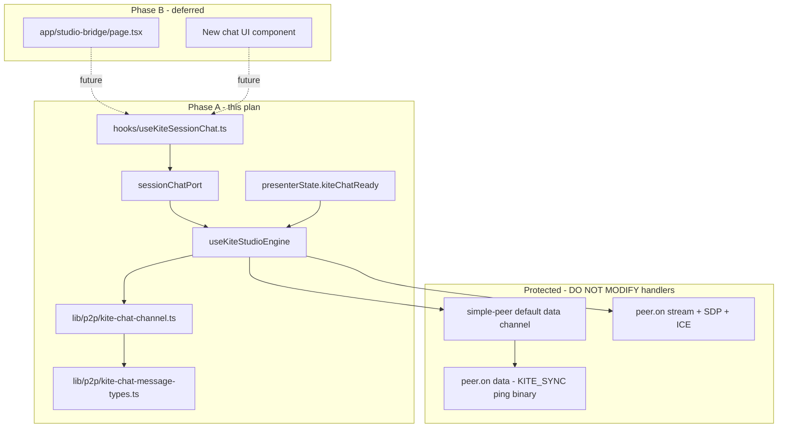

# Kite Studio P2P Session Chat — Phase A (Steps 1–6)

## Scope for this phase

**In scope (Steps 1–6):** Types, pure transport, engine port, React state hook.

**Out of scope (deferred until new UI exists):**
- `components/studio-bridge/KiteSessionChat.tsx` (or any chat UI component)
- [`app/studio-bridge/page.tsx`](app/studio-bridge/page.tsx) — **zero edits** in Phase A

**Goal:** Ship a clean, testable foundation so a future UI can plug in via `useKiteSessionChat` + `sessionChatPort` without touching transport or sync code.

---

## Verification summary

**Engine / UI separation:** Transport in `lib/p2p/*` + surgical engine wire. Message state in `useKiteSessionChat`. No JSX, no layout, no presenter shell changes until Phase B.

**Regression risk:** Step 4 touches protected transport in [`hooks/useKiteStudioEngine.ts`](hooks/useKiteStudioEngine.ts). Mitigated by allow/deny edit list, Step 4b gate, and zero changes to `peer.on("data")` sync routing.

**UI swap readiness:** After Step 6, the integration contract is fixed. Phase B only adds a component + `page.tsx` wiring against this API.

---

## Architecture (Phase A)



**Live transport path:** Inline `buildTransport` in [`hooks/useKiteStudioEngine.ts`](hooks/useKiteStudioEngine.ts) (~L6500). Do **not** wire chat in `useKiteP2PTransport`.

**Sync path (untouched):** Kite Sync, ping/pong, SET_INTERVAL, binary chunks via simple-peer default channel `peer.on("data")` (~L6710). Chat uses a **second** labeled channel only.

---

## Isolation rules

Per [`.cursor/rules/ui-engine-isolation.mdc`](.cursor/rules/ui-engine-isolation.mdc):

| Zone | Phase A files | Rule |
|------|--------------|------|
| Protected engine | `useKiteStudioEngine.ts` buildTransport only | Surgical attach/teardown; no handler edits |
| Protected (zero edits) | `useKiteSyncEngine`, `useKiteP2PTransport`, worklets, looper libs, `studio-bridge-webrtc.ts` | Out of scope |
| UI-safe (Phase B) | `components/studio-bridge/**`, `page.tsx` | **Not touched in Phase A** |

---

## Step 1 — Types

**File:** [`lib/p2p/kite-chat-message-types.ts`](lib/p2p/kite-chat-message-types.ts) *(new)*

**Logical change:** Wire + UI types and guards only.

Exports:
- `KITE_CHAT_CHANNEL_LABEL = "kite-chat-channel"`
- `KiteChatDataPayload` — `{ type: "KITE_CHAT"; id: string; text: string; senderId: string; senderName: string; sentAt: number }`
- `KiteSessionChatMessage` — payload + `{ receivedAt: number; isLocal: boolean }`
- `isKiteChatDataPayload(unknown): boolean`
- `parseKiteChatDataPayloadFromChannelData(data: unknown): KiteChatDataPayload | null`

**Not touched:** Engine, UI, sync types.

---

## Step 2 — Pure channel transport

**File:** [`lib/p2p/kite-chat-channel.ts`](lib/p2p/kite-chat-channel.ts) *(new)*

**Logical change:** Browser-only RTCDataChannel lifecycle. No React, no Supabase.

Exports:
- `KiteChatChannelHandle` — `{ send(payload): boolean; close(): void; isOpen(): boolean }`
- `attachKiteChatChannel({ pc, isInitiator, onMessage, onOpen, onClose })`
  - Initiator: `pc.createDataChannel(KITE_CHAT_CHANNEL_LABEL, { ordered: true })` synchronously
  - Answerer: `pc.ondatachannel` — accept only matching label
  - `onmessage` → parse → callback; swallow malformed JSON
  - `send()` returns `false` when not open

**Not touched:** [`lib/studio-bridge-webrtc.ts`](lib/studio-bridge-webrtc.ts), engine, UI.

---

## Step 3 — Engine type surface

**File:** [`hooks/useKiteStudioEngine.types.ts`](hooks/useKiteStudioEngine.types.ts)

**Logical change:** Dedicated chat port — do **not** extend `KiteEngineLegacyApi`.

```typescript
export type KiteSessionChatPort = {
  subscribe: (handler: (msg: KiteSessionChatMessage) => void) => () => void;
  sendMessage: (text: string) => boolean;
};

export type UseKiteStudioEngineResult = {
  // ...existing...
  sessionChatPort: KiteSessionChatPort;
};
```

Add to `KitePresenterState`:
```typescript
kiteChatReady: boolean;
```

Also export hook options/return types from the same file (or co-locate in Step 6) so Phase B UI imports one stable surface:

```typescript
export type UseKiteSessionChatOptions = {
  enabled: boolean;
  sessionId: string | null;
  chatReady: boolean;
  port: KiteSessionChatPort;
};

export type UseKiteSessionChatResult = {
  messages: KiteSessionChatMessage[];
  sendMessage: (text: string) => void;
  clearMessages: () => void;
};
```

**Not touched:** `KiteEngineLegacyApi`, transport implementation, page.

---

## Step 4 — Surgical engine wire

**File:** [`hooks/useKiteStudioEngine.ts`](hooks/useKiteStudioEngine.ts)

**Logical change:** Chat channel attach, subscriber fan-out, teardown — **only**.

### Allowed edit regions

1. Module-level refs (near `peerRef` ~L557): `kiteChatHandleRef`, `kiteChatSubscribersRef`
2. Immediately after `peerRef.current = peer` (~L6520), same synchronous block as `_pc` listeners (~L6525)
3. `teardownKiteChatChannel()` before **every** `peerRef.current?.destroy()`:
   - `performTeardown` (~L6254)
   - `reconnectTransport` (~L7249)
   - Leave / bridge teardown paths
   - Unmount cleanup (~L7537)

### Explicitly FORBIDDEN

- `peer.on("data")` (~L6710), `peer.on("stream")`, `peer.on("connect")`, `peer.on("signal")`
- `sdpTransform`, Supabase handlers, looper/metronome callbacks
- `useKiteP2PTransport.ts`, `useKiteSyncEngine.ts`

### Fan-out rules

- Stamp `receivedAt: Date.now()`, `isLocal: false`
- Synchronous subscriber iteration
- No message list `setState` in engine

**Not touched:** `engineLegacy`, page, UI, return object (Step 5).

---

## Step 4b — Mandatory regression gate (no code)

**After Step 4, before Steps 5–6.** Verify on localhost, Chrome, two tabs:

| Check | Pass criteria |
|-------|---------------|
| P2P audio | Remote stream + playback graph still works |
| Ping/pong | Ping ms updates |
| Kite Sync | KITE_SYNC enable/disable + metronome lock unchanged |
| Binary chunks | Loop interval transfer unaffected (if tested) |
| Chat channel | `kite-chat-channel` reaches `open` on both sides |
| No handler bleed | Chat payloads never hit `peer.on("data")` |

If negotiation regresses: **stop** and revise Step 4 only.

**Phase A completion gate (after Step 6):** Repeat matrix including manual send/receive via temporary dev-only hook call or console — no UI required.

---

## Step 5 — Expose sessionChatPort + kiteChatReady

**File:** [`hooks/useKiteStudioEngine.ts`](hooks/useKiteStudioEngine.ts)

**Logical change:** Presenter API only.

- `presenterState.kiteChatReady` from channel `onOpen` / `onClose`
- `sessionChatPort` stable `useMemo`:
  - `subscribe(handler)` → add/remove from `kiteChatSubscribersRef`
  - `sendMessage(text)` → build `KiteChatDataPayload`, call handle `send()`
  - No optimistic echo in engine (hook owns local echo)
- Return `{ ..., sessionChatPort }`

**Not touched:** `engineLegacy`, transport attach, sync handlers, page.

---

## Step 6 — React state hook (UI integration contract)

**File:** [`hooks/useKiteSessionChat.ts`](hooks/useKiteSessionChat.ts) *(new)*

**Logical change:** Headless message state — **the only file Phase B UI needs besides page wiring.**

```typescript
export function useKiteSessionChat(
  options: UseKiteSessionChatOptions
): UseKiteSessionChatResult
```

Behavior:
- Incoming: `setMessages(prev => [...prev, msg])` — always functional
- Outgoing: on successful `port.sendMessage(text)`, append local echo with same `id`; dedupe receives by `id`
- `enabled === false` or `sessionId` change → `clearMessages()`
- No WebRTC / Supabase imports

**Not touched:** Engine transport, sync, `page.tsx`, any JSX component.

---

## Phase A step summary (Rule D)

| Step | File | Logical change |
|------|------|----------------|
| 1 | `lib/p2p/kite-chat-message-types.ts` | Types + parsers |
| 2 | `lib/p2p/kite-chat-channel.ts` | RTCDataChannel attach/send |
| 3 | `hooks/useKiteStudioEngine.types.ts` | Port + hook types + `kiteChatReady` |
| 4 | `hooks/useKiteStudioEngine.ts` | Surgical attach + teardown |
| 4b | *(gate)* | Sync + channel smoke test |
| 5 | `hooks/useKiteStudioEngine.ts` | `sessionChatPort` + ready flag |
| 6 | `hooks/useKiteSessionChat.ts` | Headless message hook |

Each step = one prompt = one file = one logical change.

---

## Phase B — Future UI swap (not in this plan)

When the new chat UI is ready, add **two steps only** (separate plan):

1. **New component** in `components/studio-bridge/` — presentational only; props from `UseKiteSessionChatResult` + `chatReady` + `remoteName`
2. **`page.tsx`** — destructure `sessionChatPort` + `presenterState.kiteChatReady`, call `useKiteSessionChat`, mount as **fixed overlay sibling** (not inside `mt-8 space-y-4` stack)

Suggested enable gate (unchanged from prior audit):
```typescript
enabled: studioUiPhase === "studio" && kiteMode !== "solo" && status === "connected"
```

Phase B must not import engine internals beyond `useKiteStudioEngine` return + `useKiteSessionChat`.

---

## Post-change reporting (every step)

- **Changed:** exact symbols/sections added or modified
- **Not touched:** audio negotiation, `peer.on("data")` sync routing, looper engine, metronome pump, Supabase signaling, `page.tsx`, chat UI components

---

## Testing sequence (Phase A)

1. Localhost, Chrome, two tabs — Step 4b gate, then hook send/receive smoke (no UI)
2. Same WiFi, two devices
3. Different networks
4. Restrictive network — `kiteChatReady` stays false, no engine crash
