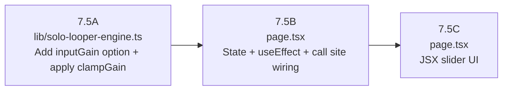

# Phase 7.5 — Loopstation Dedicated Input Trim ("Rec Trim")

## Overview

Three strictly-sequenced batches. Batches 7.5B and 7.5C both touch `page.tsx` but are **separate logical changes** (DSP wiring vs. UI rendering) and must be executed in separate prompts.

---

## Batch 7.5A — Engine DSP Plumbing

**Target file:** `lib/solo-looper-engine.ts`

### What exists today

```108:121:lib/solo-looper-engine.ts
export type BuildSoloLooperEngineOptions = {
  audioContext: AudioContext;
  inputStream: MediaStream;
  destinationNode: MediaStreamAudioDestinationNode;
  timing: Pick<KiteIntervalTiming, "localIntervalFrames" | "localSampleRate">;
  loopId?: string;
  channelCount?: 1 | 2;
  trackIndex?: number;
  outputGain?: number;
  monitorDestination?: AudioNode;
  monitorGain?: number;
  onEvent?: (event: SoloLooperEngineEvent) => void;
};
```

```316:317:lib/solo-looper-engine.ts
  inputGain.gain.value = 1;
  outputGain.gain.value = clampGain(options.outputGain);
```

`clampGain` (lines 246–249) already clamps `[0, 4]` and returns `1` for non-finite values. It is already used for `outputGain` and `monitorGain`.

### Changes

1. **Add `inputGain?: number` to `BuildSoloLooperEngineOptions`** — insert after the existing `outputGain?: number;` line (line 117):

```typescript
  outputGain?: number;
  inputGain?: number;          // <-- ADD
  monitorDestination?: AudioNode;
```

2. **Replace the hardcoded `1` at line 316** with the clamped option value:

```typescript
  // BEFORE
  inputGain.gain.value = 1;

  // AFTER
  inputGain.gain.value = clampGain(options.inputGain ?? 1);
```

> `recordingMicGainNode.gain.value = 1` (line 318) is a separate node for the session recording bus — do **not** touch it.

### What is NOT touched

- `recordingMicGainNode`
- `outputGain` / `monitorGain` logic
- `clampGain` definition
- `SoloLooperEngine` return shape (the `inputGain` node is already exported; no interface change needed)

### Local verification

1. Run `npx tsc --noEmit` — zero new errors expected.
2. Open Localhost / two tabs. Start Solo Looper. Confirm audio flows as before (no silent mic regression).

---

## Batch 7.5B — State & Live Bridge

**Target file:** `app/studio-bridge/page.tsx`

### Changes

1. **Add state declaration** near the solo looper state block (around line 619–648):

```typescript
const [soloInputGain, setSoloInputGain] = useState(0.75);
```

`0.75` ≈ −2.5 dB — a gentle pad that leaves headroom without silencing.

2. **Pass `inputGain` to all three `buildSoloLooperEngine` call sites:**

| Call site | Lines | Change |
|---|---|---|
| `ensureSoloLooperEngineBootstrapped` | 3678–3692 | add `inputGain: soloInputGain,` |
| `startSoloLooper` | 3831–3842 | add `inputGain: soloInputGain,` |
| `handleAutoCalibrateSoloLatency` | 5095–5109 | add `inputGain: soloInputGain,` |

Each insertion goes after the existing `monitorGain: 1,` line in the options object.

3. **Add a `useEffect` for live parameter updates** — place it in the same logical block as other solo looper effects:

```typescript
useEffect(() => {
  const engine = soloLooperEngineRef.current;
  if (!engine) return;
  const ctx = engine.inputGain.context as AudioContext;
  engine.inputGain.gain.setTargetAtTime(soloInputGain, ctx.currentTime, 0.01);
}, [soloInputGain]);
```

`setTargetAtTime` with a 10 ms time constant prevents zipper noise during slider drag. The `useEffect` dependency is only `[soloInputGain]` — no other state is entangled. This shape is directly liftable to a custom hook in Phase 8.

### What is NOT touched

- `mixerGainNodesRef` and `handleVolumeChange` (VoIP mixer path)
- `createLaneGraph` (VoIP send graph)
- `soloTrackVolumes` / `handleSoloTrackVolumeChange` (per-track playback gain)
- Any JSX (slider rendering is Batch 7.5C)
- `monitorGain` / `outputGain` call site values

### Local verification

1. `npx tsc --noEmit` — no new errors.
2. Open Solo Looper. Record a loop. Confirm level is slightly padded but not silent (≈ −2.5 dB).
3. In browser DevTools console: `window._dbg?.soloInputGain` (if debug bridge exists) or simply confirm no console errors on `setTargetAtTime` call when state changes.

---

## Batch 7.5C — UI Slider (Rec Trim Control)

**Target file:** `app/studio-bridge/page.tsx`

### Placement

The active V4 panel wrapper is at lines 9187–9274:

```9187:9194:app/studio-bridge/page.tsx
      {useV4LooperUi &&
      studioUiPhase !== "lobby" &&
      studioUiPhase !== "kite-setup" &&
      kiteMode === "solo" ? (
        <div className="caret-transparent outline-none select-none">
        <KiteLoopV4Panel
          ...
        />
        </div>
      ) : null}
```

### Change

Add a small overlay `<div>` as a **sibling element** inside the wrapper `<div>`, immediately **after** `</KiteLoopV4Panel>` (after line 9272) and before `</div>` (line 9273):

```tsx
{/* Rec Trim — loopstation input pad only. Does NOT affect VoIP send. */}
<div
  style={{
    position: "fixed",
    bottom: 16,
    left: 16,
    zIndex: 50,
    display: "flex",
    flexDirection: "column",
    gap: 4,
    background: "rgba(10,10,10,0.70)",
    backdropFilter: "blur(12px)",
    border: "1px solid rgba(255,255,255,0.08)",
    borderRadius: 10,
    padding: "8px 10px",
    pointerEvents: "auto",
  }}
>
  <label
    style={{ fontSize: 9, fontWeight: 700, letterSpacing: "0.1em", color: "#a8a29e", textTransform: "uppercase" }}
  >
    Rec Trim&nbsp;
    <span style={{ color: "#f5f5f4", fontWeight: 400 }}>
      {soloInputGain >= 1 ? "0 dB" : `${(20 * Math.log10(soloInputGain)).toFixed(1)} dB`}
    </span>
  </label>
  <input
    type="range"
    min={0.125}
    max={1.0}
    step={0.01}
    value={soloInputGain}
    onChange={(e) => setSoloInputGain(Number(e.target.value))}
    style={{ width: 100, accentColor: "#f97316" }}
    aria-label="Loopstation recording input trim"
  />
</div>
```

**Rationale for placement choice:**
- Fixed bottom-left does not overlap the V4 panel's existing track faders (bottom-right / center layout).
- Guarded by the same `kiteMode === "solo"` condition inherited from the parent block — it is invisible in all other modes.
- `pointer-events: auto` restores click handling inside the `caret-transparent select-none` wrapper.

### What is NOT touched

- `KiteLoopV4Panel` component (zero prop additions)
- `KiteLoopV4InputDevicesProps` (VoIP input device sliders)
- `mixerGainNodesRef` / `handleVolumeChange`
- Any other JSX panels (`devicePanel`, legacy V2 panel)

### Local verification

1. Enter Solo Studio. Confirm "Rec Trim" pill appears at bottom-left with a dB readout.
2. Drag slider left (toward −18 dB). Record a loop. Confirm the recorded level is audibly reduced.
3. Drag slider to `1.0`. Confirm readout shows "0 dB" and recorded level is at full mic amplitude.
4. Exit Solo Studio (back to lobby). Confirm the slider disappears.
5. Switch to a Kite (non-solo) session. Confirm slider is never visible. Confirm VoIP send level is unchanged regardless of the Rec Trim position.

---

## Execution Order Dependency Chain



7.5B and 7.5C cannot be merged into one prompt — they are separate logical changes to `page.tsx` (Rule of One).

---

## Constraints & Invariants

- `clampGain` range is `[0, 4]`. The slider max of `1.0` (0 dB) is well within that range; no new clamping logic needed.
- The `inputGain` node is already part of the exported `SoloLooperEngine` type, so the live-update `useEffect` can access `engine.inputGain.gain` without any type changes to the engine interface.
- Default `0.75` means the engine constructor and all three call sites will produce a slightly padded gain on first boot; if `soloInputGain` has not been changed by the user, the `useEffect` does not fire because `soloInputGain` has not changed since mount.
- The `useEffect` cleanup is intentionally omitted — `setTargetAtTime` is a one-shot scheduling call, not a subscription. There is nothing to unsubscribe from.
