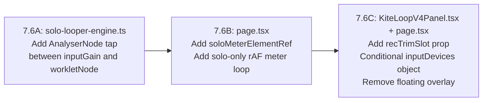

# Phase 7.6 — Audio Inputs Panel UI-Swap (Solo vs. VoIP)

## Overview

Three strictly-sequenced batches. Batches 7.6B and 7.6C both touch files in the `app/studio-bridge` and `components` tree but are separate logical changes (DSP + rAF wiring vs. UI rendering) and must be separate prompts per Rule of One.

---

## Batch 7.6A — Engine DSP Plumbing

**Target file:** `lib/solo-looper-engine.ts`

### Context

Currently the signal path at lines 346–347 is:

```
sourceNode.connect(inputGain);
inputGain.connect(workletNode);    // ← line 347
```

There is no `AnalyserNode` anywhere in the file. The `SoloLooperEngine` type (lines 158–202) exposes `inputGain` but no analyser.

### Changes — 4 surgical edits

**1. Add `inputAnalyserNode: AnalyserNode;` to `SoloLooperEngine` type (after `inputGain: GainNode;` on line 161):**

```typescript
// BEFORE
  inputGain: GainNode;
  outputGain: GainNode;

// AFTER
  inputGain: GainNode;
  inputAnalyserNode: AnalyserNode;
  outputGain: GainNode;
```

**2. Create the analyser node right after `inputGain` is created (after line 293, `preserveDiscreteInputChannels(inputGain)`):**

```typescript
  const inputAnalyserNode = ctx.createAnalyser();
  inputAnalyserNode.fftSize = 256;
```

`fftSize = 256` → `frequencyBinCount = 128` — matches the existing mixer analyser convention (same rAF read pattern at lines 1096–1098 of `page.tsx`).

**3. Change the `inputGain.connect(workletNode)` line (line 347) to insert the analyser:**

```typescript
// BEFORE
  inputGain.connect(workletNode);

// AFTER
  inputGain.connect(inputAnalyserNode);
  inputAnalyserNode.connect(workletNode);
```

**4. Add `inputAnalyserNode` to the returned engine object** (the object built at lines 464–607, returned at ~line 607). The existing members follow the same pattern — add it next to `inputGain`:

```typescript
  inputGain,
  inputAnalyserNode,      // ADD
  outputGain,
```

### What is NOT touched

- `sourceNode`, `outputGain`, `recordingMicGainNode`, `monitorGainNode`
- `clampGain`, `preserveDiscreteInputChannels`
- All worklet message handlers
- `BuildSoloLooperEngineOptions` (no new option needed)

### Verification

1. `npx tsc --noEmit` — zero errors.
2. Open Solo Looper, record a loop. Confirm audio is unchanged (analyser is a passive tap; it does not affect signal routing).

---

## Batch 7.6B — Solo Meter rAF Loop

**Target file:** `app/studio-bridge/page.tsx`

### Changes — 2 additions

**1. Add `soloMeterElementRef` after `masterLiveMeterElementRef` (line 701):**

```typescript
  const masterLiveMeterElementRef = useRef<HTMLDivElement | null>(null);
  const soloMeterElementRef = useRef<HTMLDivElement | null>(null);   // ADD
```

**2. Add a dedicated solo meter rAF `useEffect` after the existing `[soloInputGain]` effect (line 1031). Model it exactly on the `requestPlaybackUiState` loop (lines 5458–5471):**

```typescript
  useEffect(() => {
    if (kiteMode !== "solo" || studioUiPhase !== "studio") {
      return;
    }
    let rafId = 0;
    const tick = (): void => {
      const analyser = soloLooperEngineRef.current?.inputAnalyserNode;
      const meterEl = soloMeterElementRef.current;
      if (analyser && meterEl) {
        const buf = new Uint8Array(analyser.frequencyBinCount);
        analyser.getByteFrequencyData(buf);
        let peak = 0;
        for (let i = 0; i < buf.length; i += 1) {
          const sample = buf[i] ?? 0;
          if (sample > peak) peak = sample;
        }
        meterEl.style.width = `${Math.min(100, (peak / 255) * 100)}%`;
      }
      rafId = requestAnimationFrame(tick);
    };
    rafId = requestAnimationFrame(tick);
    return () => {
      cancelAnimationFrame(rafId);
    };
  }, [kiteMode, studioUiPhase]);
```

**Why no `soloInputAnalyserRef`:** the rAF reads `soloLooperEngineRef.current?.inputAnalyserNode` directly each frame. This is safe because:
- If the engine hasn't been built yet, the optional chain returns `undefined` and the meter stays at zero.
- The engine ref is always written on the main thread before the rAF tick consumes it.
- This is the same pattern used for `requestPlaybackUiState()` at lines 5463–5464.

**Why dep `[kiteMode, studioUiPhase]`:** same reason as the playback rAF loop — the loop is only meaningful during active solo studio mode. The cleanup (`cancelAnimationFrame`) fires whenever the mode exits.

### What is NOT touched

- The existing `mixerAnalyserNodesRef` rAF loop at lines 1078–1122 (unconditional, VoIP meters — NOT touched)
- `mixerGainNodesRef`, `mixerAnalyserNodesRef`
- Any JSX — UI rendering is Batch 7.6C

### Verification

1. `npx tsc --noEmit` — zero errors.
2. In the browser console, confirm the rAF loop starts when entering solo mode and stops when leaving. (Add a temporary `console.log("solo meter tick")` if needed, remove before commit.)

---

## Batch 7.6C — Conditional UI Rendering

**Target files (two files, one logical change):**
- `components/kite-loop-v2/KiteLoopV4Panel.tsx`
- `app/studio-bridge/page.tsx`

Both files are changed in this single prompt because the change is one logical unit: "wire a render-prop slot from page.tsx into the panel." Changing only one side would leave the system broken.

### Change 1 — `KiteLoopV4Panel.tsx`: add `recTrimSlot` render-prop

**A. Add `recTrimSlot?: React.ReactNode` to `KiteLoopV4InputDevicesProps` (after line 88, the `registerMasterLiveMeterElement` line):**

```typescript
// BEFORE (lines 76–89)
export type KiteLoopV4InputDevicesProps = {
  ...
  registerMasterLiveMeterElement: (el: HTMLDivElement | null) => void;
};

// AFTER
export type KiteLoopV4InputDevicesProps = {
  ...
  registerMasterLiveMeterElement: (el: HTMLDivElement | null) => void;
  recTrimSlot?: React.ReactNode;
};
```

**B. Render the slot inside `InputModal` after the CheckRow block (after line 1611, before `</>` at line 1612):**

```tsx
// Insert between the closing </div> of the CheckRow block and the closing </>
                  {inputDevices.recTrimSlot ?? null}
```

The placement is: after `</div>` that closes the interface/live-monitor checkbox section and before `</>` that closes the focused-device fragment. It is only visible when a device is focused (`focusedSelectedDeviceId != null`), which is correct — the Rec Trim is only meaningful when a mic is active.

### Change 2 — `page.tsx`: conditional `inputDevices` prop + remove floating overlay

**A. Replace the inline `inputDevices={{ ... }}` prop passed to `KiteLoopV4Panel` (lines 9265–9291) with a `useMemo`-computed object.**

The memo computes two variants:

```typescript
const inputDevicesForPanel = useMemo<KiteLoopV4InputDevicesProps>(() => {
  if (kiteMode === "solo") {
    return {
      audioInputDevices,
      activeDeviceIds,
      deviceVolumes: {},              // hides VoIP lane sliders (laneCh() falls back to 75 but no slider is shown if deviceInputChannelCount is empty)
      deviceInputChannelCount: {},    // ensures chCount = 1, but more importantly InputModal sees no volume context
      interfaceInputDeviceFlags,
      interfaceLiveMonitorEnabledFlags,
      onToggleDeviceActive: (deviceId) => void toggleAudioDevice(deviceId),
      onSetDeviceLaneVolume: () => {},     // noop — sliders hidden
      onSetInterfaceInputFlag: setInterfaceInputDeviceFlag,
      onSetInterfaceLiveMonitor: setInterfaceLiveMonitorEnabledFlag,
      registerMixerMeterElement: () => {},    // noop — solo has its own meter
      registerMasterLiveMeterElement: () => {},
      recTrimSlot: (
        <>
          {/* Solo input meter — reads from soloLooperEngineRef via soloMeterElementRef */}
          <div style={{ marginTop: 8 }}>
            <span
              style={{
                fontSize: 8,
                fontWeight: 700,
                letterSpacing: "0.18em",
                textTransform: "uppercase",
                color: "rgba(255,255,255,0.35)",
                fontFamily: "monospace",
              }}
            >
              Mic Level
            </span>
            <div
              style={{
                marginTop: 4,
                height: 4,
                width: "100%",
                background: "rgba(255,255,255,0.07)",
                borderRadius: 2,
                overflow: "hidden",
              }}
            >
              <div
                ref={(el) => { soloMeterElementRef.current = el; }}
                style={{
                  height: "100%",
                  width: "0%",
                  background: "#22c55e",
                  borderRadius: 2,
                  transition: "width 75ms linear",
                }}
              />
            </div>
          </div>
          {/* Input Gain slider (moved from floating overlay) */}
          <div style={{ marginTop: 10 }}>
            <label
              style={{
                fontSize: 8,
                fontWeight: 700,
                letterSpacing: "0.18em",
                textTransform: "uppercase",
                color: "rgba(255,255,255,0.35)",
                fontFamily: "monospace",
                display: "block",
                marginBottom: 4,
              }}
            >
              Gain&nbsp;
              <span style={{ color: "#f5f5f4", fontWeight: 400 }}>
                {soloInputGain >= 1 ? "0 dB" : `${(20 * Math.log10(soloInputGain)).toFixed(1)} dB`}
              </span>
            </label>
            <input
              type="range"
              min={0.125}
              max={1.0}
              step={0.01}
              value={soloInputGain}
              onChange={(e) => setSoloInputGain(Number(e.target.value))}
              style={{ width: "100%", accentColor: "#f97316" }}
              aria-label="Loopstation recording input gain"
            />
          </div>
        </>
      ),
    };
  }
  // VoIP / kite mode: full live props
  return {
    audioInputDevices,
    activeDeviceIds,
    deviceVolumes,
    deviceInputChannelCount,
    interfaceInputDeviceFlags,
    interfaceLiveMonitorEnabledFlags,
    onToggleDeviceActive: (deviceId) => void toggleAudioDevice(deviceId),
    onSetDeviceLaneVolume: (deviceId, lane, value) =>
      handleVolumeChange(`${deviceId}:ch${lane}`, value),
    onSetInterfaceInputFlag: setInterfaceInputDeviceFlag,
    onSetInterfaceLiveMonitor: setInterfaceLiveMonitorEnabledFlag,
    registerMixerMeterElement,
    registerMasterLiveMeterElement,
  };
}, [
  kiteMode,
  audioInputDevices,
  activeDeviceIds,
  deviceVolumes,
  deviceInputChannelCount,
  interfaceInputDeviceFlags,
  interfaceLiveMonitorEnabledFlags,
  toggleAudioDevice,
  handleVolumeChange,
  setInterfaceInputDeviceFlag,
  setInterfaceLiveMonitorEnabledFlag,
  registerMixerMeterElement,
  registerMasterLiveMeterElement,
  soloInputGain,
  setSoloInputGain,
]);
```

The memo must be placed **before** the `renderVisualMetronomeControls` call or the return statement — ideally near the other `useMemo`/`useCallback` declarations.

**B. Replace the `inputDevices={{ ... }}` inline prop** in the `KiteLoopV4Panel` JSX call with `inputDevices={inputDevicesForPanel}`.

**C. Remove the floating "Gain" overlay** (the `<div style={{ position: "fixed", bottom: 16, left: 16 ... }}>` block added in Phase 7.5, approximately lines 9289–9327) entirely. Its contents now live inside `recTrimSlot`.

### Why `deviceVolumes: {}` and `deviceInputChannelCount: {}` hide the sliders

Inside `InputModal`, the gain sliders are wrapped in `{focusedSelectedDeviceId != null ? (` (line 1559). The slider section renders `laneCh(lane)`, which reads `deviceVolumes[\`${focusedSelectedDeviceId}:ch${lane}\`] ?? 75` — but the sliders still appear because the guard is only on `focusedSelectedDeviceId`. Passing `deviceVolumes: {}` alone does not hide the sliders; it only makes them stuck at the `75` fallback.

To actually suppress the sliders, the recommended approach is to add a second condition inside `InputModal`:

```tsx
// In KiteLoopV4Panel.tsx, wrap the Input Gain section (line 1558–1587):
{focusedSelectedDeviceId != null && Object.keys(inputDevices.deviceVolumes).length > 0 ? (
  // ... Input Gain sliders ...
) : null}
```

This is still a minimal, targeted change to `KiteLoopV4Panel.tsx` within the same Batch 7.6C prompt. Passing `deviceVolumes: {}` from `page.tsx` then becomes the signal.

### What is NOT touched

- `mixerGainNodesRef` (VoIP faders remain live in the audio graph)
- `mixerAnalyserNodesRef` and the existing rAF meter loop at lines 1078–1122
- `createLaneGraph`, `handleVolumeChange`
- `KiteLoopV4Panel` internals beyond the two targeted lines (type + render-prop)

### Verification

1. `npx tsc --noEmit` — zero errors.
2. Enter Solo Studio. Open the input panel. Confirm:
   - VoIP lane sliders are hidden.
   - "Mic Level" meter bar animates when speaking into mic.
   - "Gain" slider is present and dB readout updates when dragged.
   - Floating bottom-left overlay is gone.
3. Enter a VoIP / Kite session. Open the input panel. Confirm:
   - VoIP lane sliders are visible and functional.
   - No "Gain" slider or Solo meter visible.
4. During a VoIP session, change an input device volume. Confirm audio level in headphones changes (proves `mixerGainNodesRef` was not disrupted).

---

## Execution Order



---

## Invariants & Isolation Boundaries

### P2P / Broadcast Mode Is Completely Out of Scope

`KiteLoopV4Panel` is rendered exclusively under the condition `kiteMode === "solo"` (guarded in `page.tsx`). It is **never mounted** when `kiteMode` is `"live"`, `"sync"`, or `"broadcast"`. This means every JSX change in Batch 7.6C — the `recTrimSlot`, the `inputDevicesForPanel` memo, the conditional slider suppression, and the floating overlay removal — is physically unreachable from any P2P or broadcast session.

**IRONCLAD DIRECTIVE: Do NOT attempt to restore, create, or wire any input device controls, modals, or audio panels for the P2P / Broadcast view inside this phase. The P2P path (`kiteMode !== "solo"`) must remain completely untouched until the Loopstation is fully verified and stable.**

Specific boundaries that must not be crossed in any batch of Phase 7.6:

- Do not modify `BroadcastDashboard` (defined inline in `page.tsx` at line ~4787, and the separate `components/studio-bridge/BroadcastDashboard.tsx`).
- Do not add any rendering branch for `kiteMode === "live"`, `"sync"`, or `"broadcast"` inside `KiteLoopV4Panel.tsx`.
- Do not wire `registerMixerMeterElement` or `registerMasterLiveMeterElement` to any new DOM element in the P2P session path.
- Do not change the condition `!stealthBroadcastUiLock && !useV4LooperUi` guarding the legacy floating "Audio Inputs" panel at line ~8976. That panel is dead code and must remain untouched.
- The VoIP path of `inputDevicesForPanel` (the `kiteMode !== "solo"` branch) exists solely as a passthrough to preserve the existing contract. It must not be used to render any new P2P UI inside this phase.

### Why This Is Safe

The `mixerGainNodesRef` and `mixerAnalyserNodesRef` audio graphs operate imperatively and remain fully live during any P2P session regardless of what JSX renders. Hiding their corresponding UI in solo mode (by passing `deviceVolumes: {}`) does not disconnect any nodes, does not alter gain values, and does not affect WebRTC send quality. The P2P audio engine is completely decoupled from the UI changes in this phase.

---

## Phase 8 Extraction Notes

The `inputDevicesForPanel` memo is a clean extraction target. In Phase 8, it moves to a `useSoloLooperInputDevicesPanel(...)` hook, taking `kiteMode`, `soloInputGain`, `setSoloInputGain`, `soloMeterElementRef`, and all device state as arguments. No entanglement with the audio graph itself.

The P2P input controls panel (device selection + VoIP lane sliders for Live Mode) is a separate future deliverable. It will be planned and executed as its own phase after the Loopstation is verified end-to-end.
