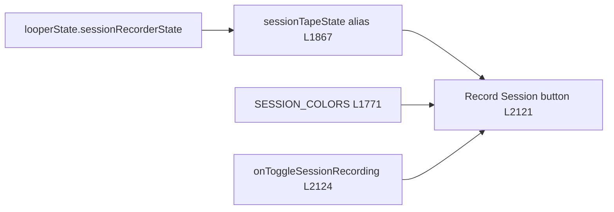

# Record Session Button UI Plan

**Scope:** [`components/kite-loop-v2/KiteLoopV4Panel.tsx`](../components/kite-loop-v2/KiteLoopV4Panel.tsx) only  
**Out of scope:** `useKiteStudioEngine`, `onToggleSessionRecording` logic, worklets, transport

**Status:** Implemented (idle styling only)

---

## Phase 1 — Read-Only Audit

### Location

The Record Session button is at **lines 2121–2152** (search for `"Record Session"` or `onToggleSessionRecording` if line numbers drift).

### State wiring



- State alias: `const sessionTapeState = looperState.sessionRecorderState;` (L1867)
- Toggle handler: `onClick={() => looperHandlers.onToggleSessionRecording()}` (L2124)
- Label branches: `idle` → `"Record Session"`, `recording` → `"Recording…"`, `paused` → `"Tape Paused"`, `saving` → `"Saving…"` (L2145–2151)

### Styling mechanism

This button uses **inline `style={{}}` objects**, not Tailwind `className`, consistent with other nav controls in this panel.

Conditional styling is driven by `sessionTapeState`:

| Property | Idle (`sessionTapeState === "idle"`) | Active (`!== "idle"`: recording / paused / saving) |
|----------|----------------------------------------|------------------------------------------------------|
| `border` | ~~`rgba(255,255,255,0.08)`~~ → **`rgba(239, 68, 68, 0.5)`** | `rgba(255,69,0,0.45)` (unchanged) |
| `background` | ~~`rgba(10,10,10,0.75)`~~ → **`rgba(239, 68, 68, 0.06)`** | `rgba(255,69,0,0.08)` (unchanged) |
| `color` | ~~`rgba(255,255,255,0.4)`~~ → **`#ef4444`** | `SESSION_COLORS[sessionTapeState]` (unchanged) |
| `cursor` | `"pointer"` | `"wait"` only when `saving`; else `"pointer"` |
| Circle `fill` | `"transparent"` | `ORANGE` when `recording`; else `"transparent"` |
| Circle `color` | `SESSION_COLORS.idle` | `SESSION_COLORS[sessionTapeState]` |

### Previous idle color token (why it looked disabled)

```ts
const SESSION_COLORS: Record<KiteLoopV4SessionRecorderState, string> = {
  idle: "rgba(255,255,255,0.4)", // 40% white — looked disabled
  recording: ORANGE,
  paused: "#eab308",
  saving: EMERALD,
};
```

Idle text was 40% white with a near-invisible border and dark glass background — no record affordance.

`SESSION_COLORS` is used **only** on this button — safe to change `idle` without side effects.

---

## Phase 2 — Proposed Fix (applied)

### Design intent

- **Idle:** Vibrant record-red — clearly clickable, distinct from orange Play/Pause transport.
- **Recording (and other non-idle states):** Unchanged — orange border tint, orange text, filled orange dot when recording.

### Tailwind reference → inline equivalents applied

| Tailwind hint | Inline value | Applied |
|---------------|--------------|---------|
| `text-red-500` | `#ef4444` | `SESSION_COLORS.idle` |
| `border-red-500/50` | `rgba(239, 68, 68, 0.5)` | Idle border ternary false-branch |
| (subtle idle tint) | `rgba(239, 68, 68, 0.06)` | Idle background ternary false-branch |

Hover deferred — nav buttons in this file do not use hover states today.

### Changes made

**1. `SESSION_COLORS.idle`**

```ts
idle: "#ef4444",
```

**2. Record Session button idle border/background**

```ts
border: `1px solid ${sessionTapeState !== "idle" ? "rgba(255,69,0,0.45)" : "rgba(239, 68, 68, 0.5)"}`,
background: sessionTapeState !== "idle" ? "rgba(255,69,0,0.08)" : "rgba(239, 68, 68, 0.06)",
```

**3. Circle icon** — no structural change; inherits red idle color via `SESSION_COLORS[sessionTapeState]`.

---

## Safety Check

| Area | Touch? | Notes |
|------|--------|-------|
| `onClick` / `onToggleSessionRecording` | No | Unchanged |
| `disabled={sessionTapeState === "saving"}` | No | Unchanged |
| `cursor` logic | No | Unchanged |
| Recording label `"Recording…"` | No | Unchanged |
| Non-idle border/background (orange) | No | Ternary true-branch values identical |
| `SESSION_COLORS.recording` / `paused` / `saving` | No | Only `idle` key changed |
| Circle `fill` when `recording` | No | Still `ORANGE` |
| Engine / recorder state machine | No | Presenter-only CSS |

---

## Manual test checklist

1. Localhost, Chrome — idle button reads red and clickable; click starts recording with existing orange active styling.
2. Verify `saving` still shows wait cursor and emerald label.
3. Verify `paused` still shows yellow label with orange-tinted active shell.

---

## What was NOT touched

- `hooks/useKiteStudioEngine.ts` and all recording logic
- Play/Pause, Camera, Settings, End Session buttons
- Lane-level record controls (`REC_CFG`, track arm buttons)
- `glassSharp` / `glass` primitives
- Any worklet or audio path
