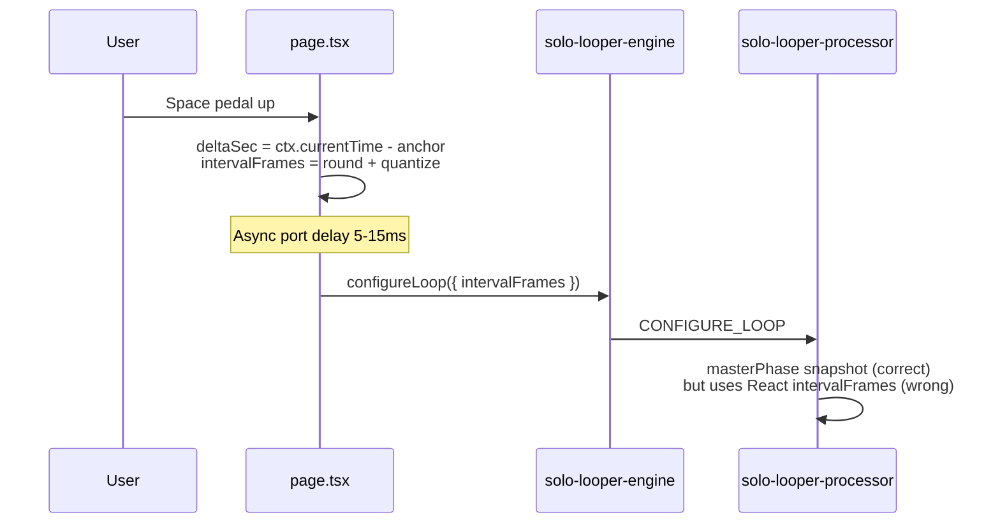
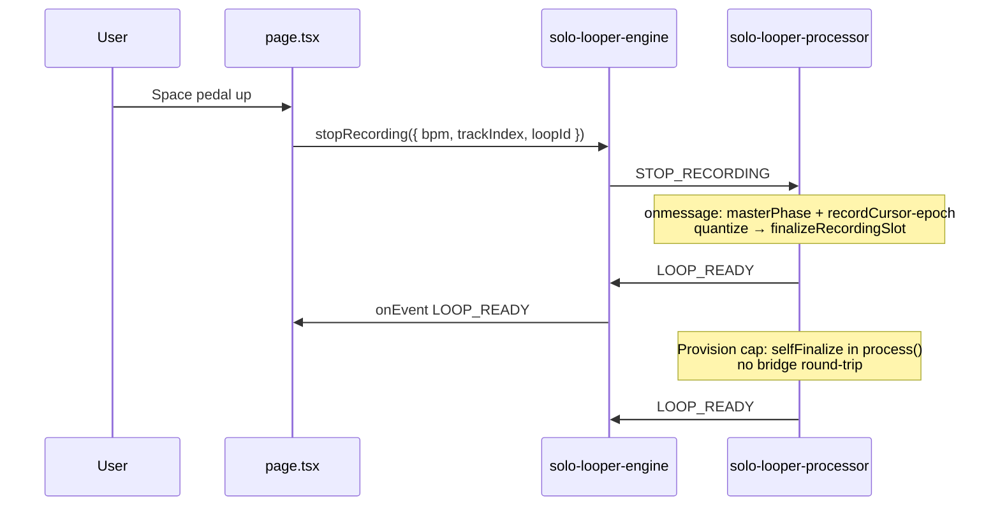

# V4.1 Execution Plan — Atomic Clock Upgrade (Staff Audit Resolutions)

**Canonical artifact:** `.cursor/plans/v4.1-atomic-clock-upgrade.plan.md`  
**Supersedes:** V4 draft (`recordingEpochFrames` + single-authority `STOP_RECORDING` architecture — unchanged and approved)

## Diagnosis (current state)

Pedal-up finalization follows a **split-clock** path that causes 5–15ms layering drift:



**Root cause:** [`commitActiveRecording`](app/studio-bridge/page.tsx) (lines 4566–4611) computes `deltaSec`, `rawTargetFrames`, beat quantization (Track 1), and `snapToMasterMultiple` (Tracks 2–4) from `AudioContext.currentTime`. The worklet owns sample-accurate `recordCursor` and `masterPhase` ([`solo-looper-processor.js`](public/worklets/solo-looper-processor.js) lines 347–350, 399–440) but **trusts** `data.intervalFrames` from the bridge for trim length.

**Target state:** React sends a **zero-math** atomic command; the worklet snapshots phase and computes `intervalFrames` synchronously inside `onmessage` (and self-finalizes on provision cap without bridge round-trip).

---

## P2P Live Mode & Kite Sync — Hard Isolation Contract

These systems share [`app/studio-bridge/page.tsx`](app/studio-bridge/page.tsx) but use a **separate engine and worklet**. V4.1 must not alter their behavior.

| System | Engine / worklet | Must remain unchanged |
|--------|------------------|------------------------|
| Live mode (VoIP) | `lib/studio-bridge-webrtc.ts`, WebRTC graphs | Signaling, ICE/TURN, mic acquire, remote playback |
| Kite Sync control | `KITE_SYNC` DataChannel handler (~5803+) | Packet schema, RTT alignment, `guestTargetSec`, sequence/revision guards |
| Kite Sync audio | `lib/kite-interval-graph.ts` + [`kite-interval-processor.js`](public/worklets/kite-interval-processor.js) | `SET_INTERVAL`, grid pump, `loadInterval`, `INTERVAL_READY` send path |
| P2P interval math | `lib/kite-interval-math.ts` (`calcIntervalFrames`) | Wizard BPM/BPI → fixed grid length |

**Allowed coupling (read-only from solo path):**
- Pass **BPM as configuration** on `STOP_RECORDING` (same source as today: `kiteIntervalTimingRef.current?.bpm` or `deriveKiteTimingMetadata().bpm`). Configuration only — not time math.
- [`LOOP_READY`](app/studio-bridge/page.tsx) handler (~3681–3704) continues to populate `retainedKiteLoopBufferRef` from worklet-emitted `intervalFrames`.

**Forbidden edits (zero diffs):**
- `lib/studio-bridge-webrtc.ts`, `lib/kite-interval-graph.ts`, `public/worklets/kite-interval-processor.js`
- `lib/kite-data-chunking.ts`, `lib/kite-interval-math.ts` (no changes required for V4.1)
- DataChannel handlers: `KITE_SYNC`, `SET_INTERVAL`, `STUDIO_PARAM`, binary `LOAD_INTERVAL`
- `cleanupKiteEngine`, `startP2PEngine`, `advanceP2PGridBoundaries`, `broadcastKiteSync`, guest grid alignment
- `kiteMode` transitions and `looperFootPedalArmed` gating

**Regression gate:** After every ticket, run Verification Matrix **C** (P2P / Kite Sync / live VoIP unchanged).

---

## Fix 1 — Worklet Quantization (Track 1 + Tracks 2–4)

### Shared ceiling constant (clarification)

All quantize paths (Track 1, Tracks 2–4, provision-cap self-finalize, `finishRecording` at cap) MUST clamp with the **same** ceiling:

```javascript
this.maxRecordingFrames = Math.floor(sampleRate * MAX_RECORDING_SECONDS); // 60 s
```

- No separate overdub cap vs master cap.
- `clampIntervalFrames()` and `computeFinalIntervalFrames()` both use `this.maxRecordingFrames` as the upper bound after beat/master snapping.

### Track 1 (master loop length)

```
rawTargetFrames = slot.recordCursor - slot.recordingEpochFrames
framesPerBeat = sampleRate * (60 / bpm)
beatsRounded = max(1, round(rawTargetFrames / framesPerBeat))
intervalFrames = clamp(round(beatsRounded * framesPerBeat), 1, maxRecordingFrames)
```

- **BPM** on `STOP_RECORDING` from React (default 120 if missing/invalid).
- **No** `AudioContext.currentTime` in worklet for length.

**Rounding clarification (Test A2):** `beatsRounded = Math.round(rawTargetFrames / framesPerBeat)` — e.g. **exactly 2.5 beats rounds UP to 3 beats** (standard `Math.round` at .5).

### Tracks 2–4 (master multiple snap)

Inline copy of [`snapToMasterMultiple`](lib/looper-math.ts) in worklet (must stay algorithm-identical; comment references TS source).

```
rawTargetFrames = slot.recordCursor - slot.recordingEpochFrames
masterFrames = trackSlots[0].intervalFrames
intervalFrames = snapToMasterMultiple(rawTargetFrames, masterFrames)
intervalFrames = clamp(floor(intervalFrames), 1, maxRecordingFrames)
```

Reject if `masterPhase === null` → emit `CONFIGURE_REJECTED` (see Gap 4 resolution).

### `recordingEpochFrames` (slot field)

| Event | Set `slot.recordingEpochFrames` |
|-------|--------------------------------|
| `startRecording()` (Track 1) | `slot.recordCursor` after `applyPreRollToSlot` |
| `beginOverdubRecordingAtDownbeat()` (2–4) | `slot.recordCursor` after `applyPreRollToSlot` |

### Internal finalize API (single code path)

Extract recording finalize into **`finalizeRecordingSlot(targetTrackIndex, nextIntervalFrames, meta)`** (trim buffer, fades, phase lock, `LOOP_READY`). All finalize authorities call this:

| Authority | Trigger |
|-----------|---------|
| `STOP_RECORDING` (`onmessage`) | Pedal-up from bridge (E1/P1) |
| **Provision cap (Gap 3)** | `clampOverdubRecordingAtProvisionCap` → internal finalize **in same `process()` turn** |
| Track 1 buffer full | `finishRecording()` → same quantizer + `finalizeRecordingSlot` |

**Deprecate:** recording-mode `CONFIGURE_LOOP` with bridge-supplied `intervalFrames` → post `CONFIGURE_REJECTED`, do not finalize.

---

## Fix 2 — Atomic Phase Snapshot

On every finalize entry (`STOP_RECORDING` handler and provision-cap self-finalize), **synchronously** in the calling context before length math:

```javascript
const master = this.trackSlots[0];
const masterPhase =
  master.mode === "playing" && master.intervalFrames > 0
    ? master.playbackCursor % master.intervalFrames
    : null;
```

Overdub: `slot.playbackCursor = masterPhase % nextIntervalFrames`. Never re-read master cursor after async delay.

---

## Gap 3 Resolution — Provision Cap Self-Finalization (Ticket W1)

**Requirement:** When [`clampOverdubRecordingAtProvisionCap`](public/worklets/solo-looper-processor.js) clamps `recordCursor` to the 60s provision ceiling, the worklet MUST **not** wait for React to send `STOP_RECORDING`.

**W1 behavior:**
1. In `process()`, when overdub track hits provision cap (existing `recordCursor >= intervalFrames` path).
2. Call shared internal helper, e.g. `selfFinalizeRecording(trackIndex)`:
   - Snapshot `masterPhase` immediately (same as `STOP_RECORDING`).
   - Run `computeFinalIntervalFrames(trackIndex, slot, this.lastKnownBpm)` — store BPM on arm/start or default 120.
   - Call `finalizeRecordingSlot(...)`.
   - Emit `LOOP_READY` (and `CONFIGURE_CLAMPED` if applicable).
3. **No** `port.postMessage` to main expecting a reply; **no** bridge round-trip.

**Page implication (P1):** `commitActiveRecording` is not required for provision-cap completion; `LOOP_READY` handler already clears `soloLooperLoopFinalizePendingRef` and updates state.

---

## Gap 4 Resolution — Allowlist Trap (Ticket E1)

Today rejections use `reportState("CONFIGURE_REJECTED")` → `LOOP_STATE` with nested `state`. The page `onEvent` handler **does not** handle `LOOP_STATE`, so rejections are effectively silent even though `LOOP_STATE` is allowlisted.

**E1 requirements:**
1. Add **`CONFIGURE_REJECTED`** to the `allowlist` in [`solo-looper-engine.ts`](lib/solo-looper-engine.ts) `port.onmessage` (~257–266).
2. Export `SoloLooperConfigureRejectedEvent` type, e.g. `{ type: "CONFIGURE_REJECTED"; reason: string; trackIndex: number; sampleRate: number }`.
3. Extend `SoloLooperEngineEvent` union.

**W1 pairing:** On rejection paths (recording-mode `CONFIGURE_LOOP`, invalid `STOP_RECORDING`, `master_not_playing_at_finalize`), post explicit:

```javascript
{ type: "CONFIGURE_REJECTED", reason, trackIndex, sampleRate }
```

Keep `OVERDUB_ARM_REJECTED` for arm-phase failures; use `CONFIGURE_REJECTED` for finalize/configure conflicts.

**P1 (minimal):** In solo `onEvent`, handle `CONFIGURE_REJECTED` like `master_not_playing_at_finalize` — clear `soloLooperLoopFinalizePendingRef`, reset overdub arm state, `console.warn`. No P2P paths touched.

---

## Message Protocol (V4.1)

### Main → worklet

| type | When | Payload |
|------|------|---------|
| `STOP_RECORDING` | Pedal-up | `trackIndex?`, `bpm?`, `channelCount?`, `loopId?` — **no** `intervalFrames` |
| `CONFIGURE_LOOP` | Engine init (60s provision), idle config only | unchanged |
| Others | `START_RECORDING`, `ARM_OVERDUB`, etc. | unchanged |

### Worklet → main

| type | Notes |
|------|-------|
| `LOOP_READY` | Unchanged; sole source of `intervalFrames` for UI/retained loop |
| `CONFIGURE_REJECTED` | **New explicit type** (Gap 4) |
| `CONFIGURE_CLAMPED` | Unchanged |
| `OVERDUB_*`, `PLAYBACK_UI_STATE` | Unchanged |

---

## File-by-File Implementation Checklist

### Ticket W1 — [`public/worklets/solo-looper-processor.js`](public/worklets/solo-looper-processor.js)

**Core quantize & finalize**
- [ ] Add `recordingEpochFrames` to `createEmptySlot()`; set in `startRecording()` and `beginOverdubRecordingAtDownbeat()`
- [ ] Store `lastKnownBpm` (from `STOP_RECORDING` or arm/start default 120) for provision-cap self-finalize
- [ ] Inline `snapToMasterMultiple()` + `quantizeTrack1ToBeats()` — document parity with [`lib/looper-math.ts`](lib/looper-math.ts)
- [ ] `computeFinalIntervalFrames()` — **always** clamp to `this.maxRecordingFrames` (Track 1 and overdubs)
- [ ] Extract `finalizeRecordingSlot()` from current `configureLoop` recording branch
- [ ] `stopRecording(data)` in `onmessage`: sync `masterPhase` → compute frames → finalize
- [ ] Wire `STOP_RECORDING` in `port.onmessage`
- [ ] Reject recording-mode `CONFIGURE_LOOP` → post `type: "CONFIGURE_REJECTED"` (not only `LOOP_STATE`)

**Gap 3 — Provision cap self-finalize**
- [ ] Refactor `clampOverdubRecordingAtProvisionCap` to call `selfFinalizeRecording(trackIndex)` (quantize + phase-lock + `LOOP_READY`) **inside `process()`**, no bridge wait
- [ ] Route Track 1 `finishRecording()` through same `computeFinalIntervalFrames` + `finalizeRecordingSlot`

**Implementation test harness (pre-E1/P1)**
- [ ] Add temporary dev hook: expose on `globalThis` or document console snippet after engine build, e.g.:

```javascript
// Dev-only: verify worklet STOP_RECORDING before E1/P1
// After solo engine exists and track is recording:
soloLooperEngineRef.current?.workletNode.port.postMessage({
  type: "STOP_RECORDING",
  trackIndex: 1,
  bpm: 120,
  channelCount: 2,
});
```

- [ ] W1 sign-off: trigger harness while recording → `LOOP_READY` fires with worklet-computed `intervalFrames`; no React `configureLoop` on stop

**W1 must NOT touch:** `kite-interval-processor.js`, P2P handlers

---

### Ticket E1 — [`lib/solo-looper-engine.ts`](lib/solo-looper-engine.ts)

- [ ] `SoloLooperStopRecordingParams` + `stopRecording(params)` posting `STOP_RECORDING`
- [ ] **`CONFIGURE_REJECTED` in allowlist** (Gap 4)
- [ ] `SoloLooperConfigureRejectedEvent` + union update
- [ ] JSDoc: `configureLoop()` = provision/init only; pedal-up = `stopRecording()`
- [ ] No changes to P2P/kite-interval modules

---

### Ticket P1 — [`app/studio-bridge/page.tsx`](app/studio-bridge/page.tsx) *(solo paths only)*

- [ ] `commitActiveRecording`: remove `deltaSec`, `rawTargetFrames`, `Math.round`, beat math, `snapToMasterMultiple`; call `engine.stopRecording({ trackIndex, bpm, channelCount: 2, loopId })`
- [ ] Defer `masterLoopIntervalFramesRef` / `setSoloMasterLoopFrames` to `LOOP_READY` only
- [ ] Handle `CONFIGURE_REJECTED` in solo `onEvent` (clear finalize pending, warn)
- [ ] Remove dead refs: `soloTrack1RecordAnchorContextSecRef`, `soloSecondaryRecordAnchorContextSecRef` and assignments
- [ ] Remove `snapToMasterMultiple` import if unused
- [ ] **Do not modify:** `cleanupKiteEngine`, P2P/Kite Sync handlers, `deriveKiteTimingMetadata` body, grid pump

---

### Ticket M1 — [`lib/looper-math.ts`](lib/looper-math.ts) *(hygiene)*

- [ ] Header comment: worklet inline must match `snapToMasterMultiple` exactly
- [ ] No algorithm change unless audit finds drift

---

### Explicitly out of scope (V4.1)

- P2P / Kite Sync / live VoIP files (isolation contract)
- [`components/kite-loop-v2/*`](components/kite-loop-v2/), [`hooks/useLooperFootPedal.ts`](hooks/useLooperFootPedal.ts)
- [`lib/looper-runway-scheduler.ts`](lib/looper-runway-scheduler.ts) stop-math only; runway unchanged
- **V5 items** (see roadmap below)

---

## End-to-End Flow (after V4.1)



---

## Verification Matrix

### A — Sloppy Stopwatch (primary)

| ID | Test | Pass criteria |
|----|------|----------------|
| A1 | Track 1: 4-beat runway → record 4 beats → pedal up | ≤1–2 ms perceptual drift vs metronome over 5 repeats (eliminate 5–15 ms) |
| A2 | Track 1: record **exactly 2.5 beats** → pedal up | Quantized to **3 beats** (`Math.round(2.5) === 3` on beat grid) |
| A3 | Track 2 overdub over playing Track 1 | Length = N × master; no phase slip after 8+ master cycles |
| A4 | Rapid double-tap pedal | No double finalize; no stuck `recording` |
| A5 | Track 1 hits 60s provision | Auto finalize uses same quantizer as pedal-up |
| **A6** | **Overdub hits 60s provision without pedal** | **Gap 3:** `LOOP_READY` without bridge `STOP_RECORDING`; state → captured |

### B — Solo regression

| ID | Test | Pass criteria |
|----|------|----------------|
| B1 | Pre-roll | Attack not clipped |
| B2 | Overdub downbeat arm | `OVERDUB_STARTED` still fires (known ±127 frame slip — V5 Gap 2) |
| B3 | Stop master before overdub commit | `CONFIGURE_REJECTED` or `OVERDUB_ARM_REJECTED`; UI recovers; **not silent** (Gap 4) |
| B4 | Retained loop | Track 1 `LOOP_READY` → `retainedKiteLoopBufferRef` |
| B5 | Recording-mode `CONFIGURE_LOOP` from devtools | `CONFIGURE_REJECTED` received in `onEvent` |

### C — P2P / Live / Kite Sync (mandatory)

| ID | Test | Pass criteria |
|----|------|----------------|
| C1 | 2-tab **live** mode | VoIP unchanged |
| C2 | Kite Sync count-in → **live** | Grid, metronome, intervals unchanged |
| C3 | Solo Track 1 → peer retained loop | Chunks send; frames consistent |
| C4 | Solo record `cleanupKiteEngine` | No new broadcast crashes |

### D — Environments

| Stage | Scope |
|-------|--------|
| D1 | Localhost 2-tab: A + C |
| D2 | Same WiFi: A1, C2 |
| D3 | WiFi + cellular: C2 connect |

### W1-only harness (before E1/P1)

| ID | Test | Pass criteria |
|----|------|----------------|
| H1 | Console `postMessage({ type: "STOP_RECORDING", ... })` while recording | `LOOP_READY` with worklet `intervalFrames`; phase lock on overdub |

---

## Implementation Order

1. **W1** — Worklet + harness + Gap 3 self-finalize + `CONFIGURE_REJECTED` posts  
2. **E1** — Engine `stopRecording()` + **allowlist `CONFIGURE_REJECTED`**  
3. **P1** — Page pedal-up wiring + rejection handler  
4. **M1** — Math parity comment  

**Rule of One:** Prefer one file per ticket; W1 may be one atomic worklet file change.

---

## Risk Register

| Risk | Mitigation |
|------|------------|
| Finalize from `process()` re-entrancy | `selfFinalizeRecording` only when cap hit once; set slot mode before nested work |
| BPM for provision cap | `lastKnownBpm` on arm/record/start |
| Silent rejections | Gap 4: explicit `CONFIGURE_REJECTED` + allowlist + P1 handler |
| P2P false positives | V5 deferrals documented; do not “fix” Gap 1/2/6 in V4.1 |

---

## V5 Deferred Roadmap

**Do not implement in V4.1.** Documented to prevent scope creep and false-positive regression reports during V4.1 QA.

| Gap | Issue | V5 direction |
|-----|--------|----------------|
| **Gap 1** | Track 1 `setTimeout`-scheduled `startRecording` vs AudioContext clock | Refactor to `audioContext.currentTime` + scheduled worklet message or `setValueAtTime` gate — eliminate start drift |
| **Gap 2** | Overdub downbeat ±127 frame slip (`rem <= blockSize` block-start precision) | Sample-accurate downbeat arm inside `process()` per-frame (not block-quantized `rem`) |
| **Gap 6** | Silence tail / early-stop dropouts | Fill-forward or crossfade tail replacement when `recordCursor < intervalFrames` at finalize |

V4.1 testers should **not** file bugs for Gap 1/2/6 unless behavior regresses *worse* than pre-V4 baseline.

---

## Staff Engineer Sign-off Checklist

- [ ] React performs **zero** `intervalFrames` / `deltaSec` / `Math.round` on pedal-up
- [ ] `STOP_RECORDING` is the sole bridge-driven pedal-up finalize command
- [ ] `masterPhase` snapshotted synchronously before quantize (pedal + self-finalize)
- [ ] Track 1 beat quantize + Track 2–4 `snapToMasterMultiple` live in worklet
- [ ] **Same `maxRecordingFrames` ceiling** for Track 1 and all overdub quantizations
- [ ] **A2:** 2.5 beats → **3 beats** documented and verified
- [ ] **Provision-cap self-finalizes without bridge** (Gap 3 / Test A6)
- [ ] **`CONFIGURE_REJECTED` on engine allowlist** + worklet posts + page handler (Gap 4)
- [ ] **W1 dev harness** used to verify worklet before E1/P1 (Test H1)
- [ ] **V5 deferrals documented** (Gaps 1, 2, 6 — not in V4.1 scope)
- [ ] P2P / Kite Sync / live VoIP files untouched; Matrix **C** passes

---

## Mandatory Verification Block (per ticket)

After each ticket, run applicable rows from Matrix **A** (W1: H1 + A6; full: A–D) and always **C1** minimum for P2P isolation.
