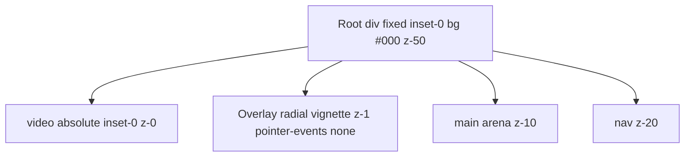
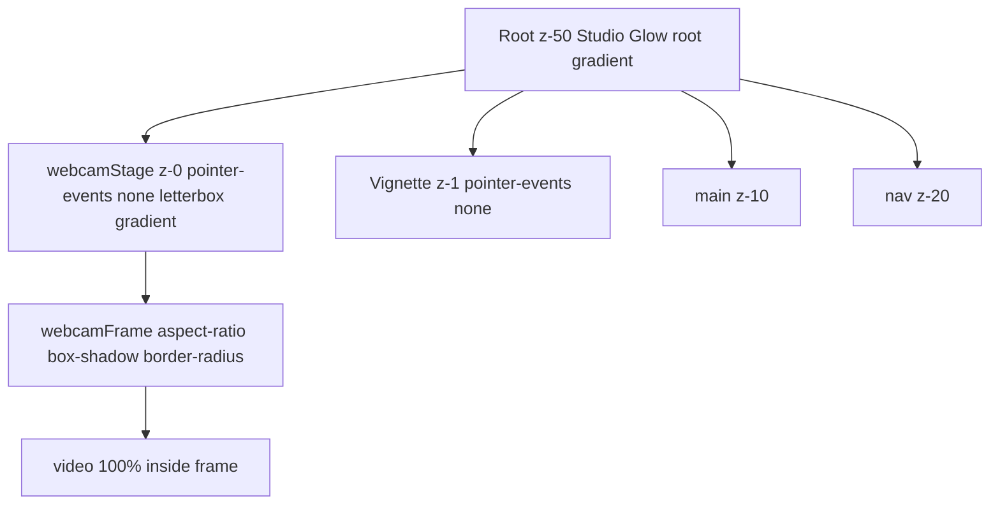

# Studio Glow UI Plan

**Scope:** [components/kite-loop-v2/KiteLoopV4Panel.tsx](components/kite-loop-v2/KiteLoopV4Panel.tsx) only  
**Prerequisite:** Webcam `<video>` uses `object-fit: contain` (crop fix already landed).  
**Out of scope:** `getUserMedia`, stream lifecycle, audio/WebRTC engine paths.

---

## Phase 1 — Read-Only Audit

### Current layer stack (~L1851–1891)



| Element | Location | Key styles |
|---------|----------|------------|
| Root container | L1852–1864 | `position: fixed`, full viewport, `background: "#000"`, `overflow: hidden`, `zIndex: 50`, flex column |
| `<video>` | L1866–1880 | `absolute inset 0`, `width/height 100%`, `objectFit: "contain"` (post crop-fix), `zIndex: 0`, `opacity: 1` |
| Vignette overlay | L1882–1890 | `absolute inset 0`, `zIndex: 1`, `pointerEvents: "none"`, black-only `radial-gradient(ellipse 80% 60% …)` |
| Main arena | L2086+ | `position: relative`, `zIndex: 10` |
| Top nav | L1894+ | `position: relative`, `zIndex: 20` |
| Capture | L1759–1783 | `getUserMedia({ video: true, audio: false })` — **do not touch** |

**Styling convention:** Panel uses inline `style={{}}` with brand tokens `ORANGE = "#ff4500"` and `EMERALD = "#22c55e"` (L133–134). One Tailwind `className` exists (L1676). Implementation should add glow constants in the same inline-token style; Tailwind equivalents are documented below for reference.

**Letterbox behavior with `object-fit: contain`:** On a full-viewport `<video>`, the picture is letterboxed *inside* the element box. Empty bands can pick up the element's own `background`, but **`border-radius` and `box-shadow` on that full-screen element apply to the viewport rectangle—not the visible picture.**

---

## Critical CSS constraint — why glow cannot go on `<video>` directly

If `<video>` remains `absolute; inset: 0; width: 100%; height: 100%; object-fit: contain`:

| Style on full-viewport `<video>` | Actual effect |
|----------------------------------|---------------|
| `border-radius: 14px` | Rounds the **window corners**, not the picture |
| `box-shadow: … glow …` | Halo sits on the **viewport edges**, misaligned with the feed |
| `filter: drop-shadow()` | Same misalignment + extra GPU filter pass (**avoid**) |

**Approved solution — aspect-ratio wrapper (primary):**

1. Add `webcamStage` (`absolute inset 0`, flex center, letterbox gradient, `pointer-events: none`, `z-index: 0`).
2. Add `webcamFrame` sized from stream metadata (`videoWidth / videoHeight` via `onLoadedMetadata`) using contain math.
3. Apply `border-radius`, `overflow: hidden`, and `box-shadow` to **`webcamFrame` only**.
4. Nest `<video>` at `width/height 100%` inside the frame. Wrapper matches stream aspect → no crop; `object-fit: cover` inside frame is equivalent to fill.

**Fallback (glow-only, no true frame hug):** Keep full-viewport contain; style letterbox via `background` radial gradient on `<video>` + stage. Skip `box-shadow` on `<video>`. Does **not** achieve a floating-screen edge glow—wrapper approach is required for that.

---

## Phase 2 — Proposed design

### Target layer stack (z-index preserved)



| Layer | z-index | pointer-events | Notes |
|-------|---------|----------------|-------|
| Root | 50 (unchanged) | auto | Host + gradient base |
| webcamStage + frame + video | 0 | **none** on stage | Never intercept clicks |
| Vignette | 1 | **none** | Unchanged pattern |
| main | 10 | auto | Looper controls |
| nav | 20 | auto | End Session, Camera, Settings |

**Clickability rule:** All webcam layers use `pointerEvents: "none"`. UI buttons keep existing `position: relative` + `zIndex: 20/10` — no change to handler wiring.

---

### 1. Container background (letterbox + camera-off)

Replace flat `background: "#000"` on root (L1863) and add stage gradient for letterbox bands.

**Root — cinematic base** (camera off + under-stage fallback):

```css
background: radial-gradient(
  ellipse 130% 110% at 50% 38%,
  rgba(34, 197, 94, 0.08) 0%,
  rgba(255, 69, 0, 0.045) 22%,
  rgba(0, 0, 0, 0.88) 55%,
  #000 100%
);
```

**Inline constant:** `STUDIO_GLOW_ROOT_BG`

**Tailwind (reference):**

```
bg-[radial-gradient(ellipse_130%_110%_at_50%_38%,rgba(34,197,94,0.08)_0%,rgba(255,69,0,0.045)_22%,rgba(0,0,0,0.88)_55%,#000_100%)]
```

**Stage — letterbox fill when camera on:**

```css
background: radial-gradient(
  ellipse 95% 85% at 50% 50%,
  rgba(34, 197, 94, 0.06) 0%,
  rgba(255, 69, 0, 0.03) 30%,
  #000 70%
);
```

**Inline constant:** `STUDIO_GLOW_STAGE_BG`

**Tailwind (reference):**

```
absolute inset-0 z-0 flex items-center justify-center pointer-events-none
bg-[radial-gradient(ellipse_95%_85%_at_50%_50%,rgba(34,197,94,0.06)_0%,rgba(255,69,0,0.03)_30%,#000_70%)]
```

**Visibility:** `opacity: isCameraActive ? 1 : 0` on stage (optional 0.25s ease). Root gradient always visible for idle studio look.

---

### 2. Video frame glow (aspect-ratio wrapper)

**New UI state** (near L1754 — no capture changes):

- `videoAspectRatio: number | null`
- Set in `onLoadedMetadata`: `video.videoWidth / video.videoHeight` (guard `> 0`)
- Reset to `null` when `cameraStream` clears

**Frame wrapper styles** (glow targets picture bounds):

```css
aspect-ratio: <videoWidth> / <videoHeight>;   /* from state; fallback 16 / 9 */
max-width: 100%;
max-height: 100%;
/* contain sizing — compute one dimension in render: */
/* if aspect >= viewportAspect → width 100%, height auto */
/* else → height 100%, width auto */
border-radius: 14px;
overflow: hidden;
box-shadow:
  0 0 0 1px rgba(255, 255, 255, 0.07),
  0 0 28px rgba(34, 197, 94, 0.14),
  0 0 56px rgba(255, 69, 0, 0.07),
  0 8px 32px rgba(0, 0, 0, 0.55);
```

**Inline constant:** `STUDIO_GLOW_FRAME_SHADOW` (shadow string only)

**Tailwind (reference):**

```
overflow-hidden rounded-[14px]
shadow-[0_0_0_1px_rgba(255,255,255,0.07),0_0_28px_rgba(34,197,94,0.14),0_0_56px_rgba(255,69,0,0.07),0_8px_32px_rgba(0,0,0,0.55)]
```

**`<video>` inside frame** (remove `absolute inset 0` full-viewport layout):

```css
display: block;
width: 100%;
height: 100%;
object-fit: cover;   /* wrapper is exact aspect — no crop vs native FOV */
background: #000;
```

Keep existing attrs: `ref`, `autoPlay`, `playsInline`, `muted`, `srcObject` effect unchanged.

**Do not apply** `box-shadow` or `border-radius` to the `<video>` tag.

---

### 3. Vignette overlay retune (L1882–1890)

Replace black-only center lift with edge darken that complements Studio Glow (no second brand gradient):

```css
background: radial-gradient(
  ellipse 85% 70% at 50% 45%,
  transparent 0%,
  rgba(0, 0, 0, 0.35) 72%,
  rgba(0, 0, 0, 0.65) 100%
);
```

Keeps `zIndex: 1`, `pointerEvents: "none"`.

---

## Performance check

| Technique | Verdict |
|-----------|---------|
| `radial-gradient` on root + stage | **Use** — static paint, compositor-friendly |
| `box-shadow` on aspect-sized frame (not full viewport) | **Use** — smaller footprint than full-screen shadow |
| `border-radius` + `overflow: hidden` on frame | **Use** — standard clip |
| `opacity` transition on stage (camera toggle) | **Use** — short, infrequent |
| `onLoadedMetadata` + resize listener for contain math | **Use** — event-driven, not per-frame |
| `backdrop-filter` / `filter: blur()` on webcam layers | **Avoid** — GPU-heavy (panel `glass` buttons already use blur elsewhere) |
| `filter: drop-shadow()` on video | **Avoid** — misaligned + filter pass |
| `will-change` / animated transforms on video | **Avoid** |

Webcam remains UI-only (L1779 comment). No impact on signaling, worklets, or looper transport.

---

## Files to modify (implementation phase)

| File | Changes |
|------|---------|
| [components/kite-loop-v2/KiteLoopV4Panel.tsx](components/kite-loop-v2/KiteLoopV4Panel.tsx) | Glow constants; `videoAspectRatio` + `onLoadedMetadata`; `webcamStage` + `webcamFrame` wrappers; root/stage gradients; frame glow; vignette retune; remove full-viewport absolute video layout |

**Not touched:**

- `hooks/useKiteStudioEngine.ts`, `hooks/useKiteSyncEngine.ts`, `lib/studio-bridge-webrtc.ts`
- `getUserMedia` (L1769), stream attach effect (L1780–1783)
- `app/studio-bridge/page.tsx`

---

## Implementation sequence

1. Add `STUDIO_GLOW_ROOT_BG`, `STUDIO_GLOW_STAGE_BG`, `STUDIO_GLOW_FRAME_SHADOW` next to `EMERALD`/`ORANGE`.
2. Add `videoAspectRatio` state + `handleVideoMetadata` + reset on stream clear.
3. Restructure JSX: root gradient → stage → frame → video; `pointerEvents: "none"` on stage.
4. Retune vignette overlay.
5. Verify z-index: nav (20) and main (10) remain clickable above webcam (0) and vignette (1).

---

## Test plan

1. **Localhost, Chrome:** Toggle Camera — full wide-angle FOV; letterbox shows emerald/orange radial fading to `#000` at edges.
2. **Frame glow:** Glow hugs picture bounds; resize window — wrapper rescales, shadow stays aligned with feed.
3. **Clickability:** All nav buttons, track columns, modals respond with camera on/off.
4. **Camera off:** Stage hidden; root gradient provides idle studio look.
5. **Performance:** No sustained GPU spikes on idle; no layout thrash during loop transport.
6. **Regression:** Mic, looper, session record unchanged (webcam not in signaling path).

---

## Approval gate

Do not implement until this plan is approved. After approval: single-file change in `KiteLoopV4Panel.tsx` per Rule of One.
